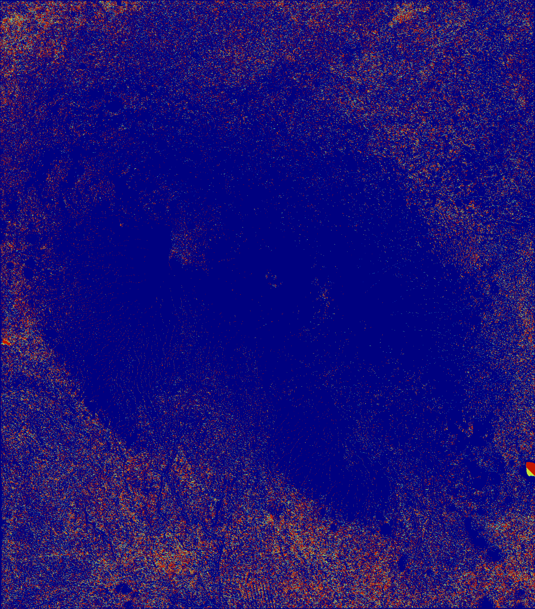
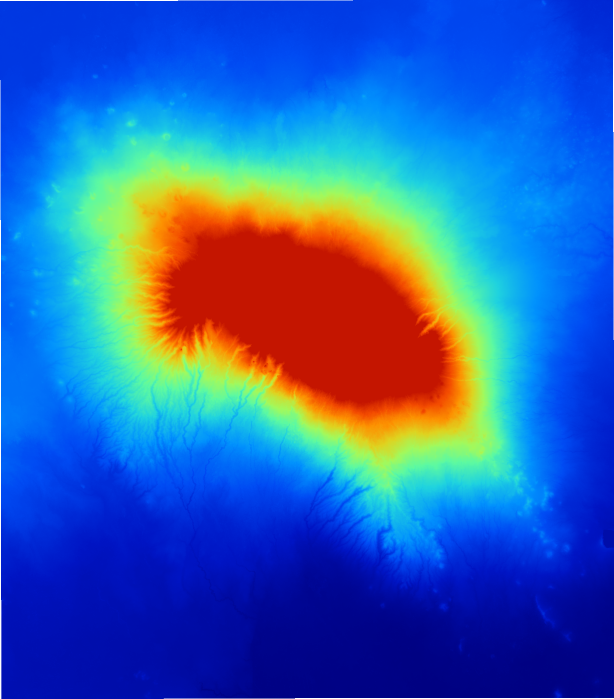
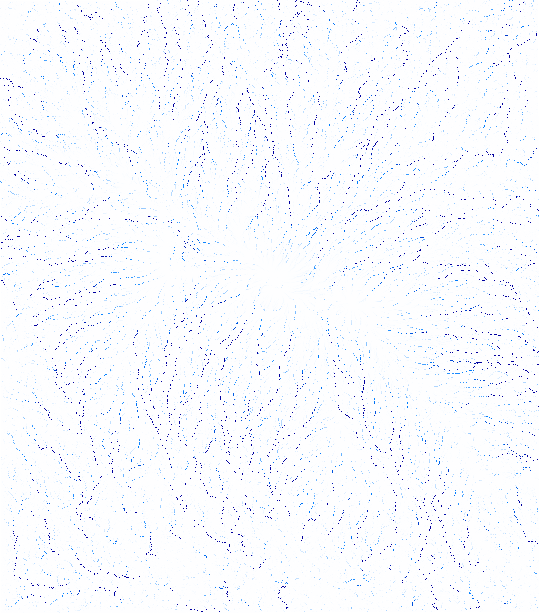
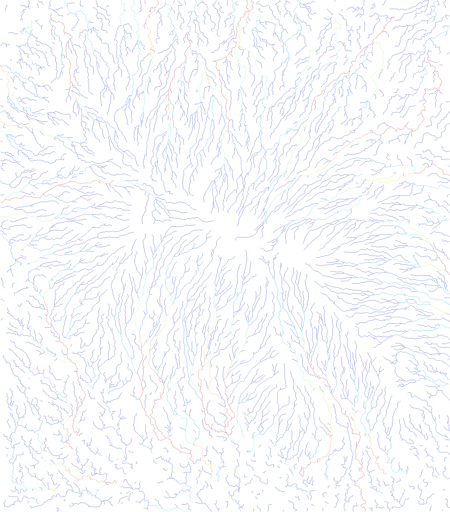

## Lab 2

After downloading the data for Mt. Kilimanjaro from Earthdata Search, I had two tiles, with each tile covering a 1 degree by 1 degree area. I then knitted these two tiles together using the "Mosaicking Tool."

I now have a map containing a digital elevation model (DEM) of Mt. Kilimanjaro. Before analysing the DEM, I first projected the recently mosaicked map into the UTM projection (Universal Transverse Mercator projection) from a geographic coordinate system so that we can accurately analyze linear measurements. I then used the analyze hillshade tool to display the amount of light, or lack of light, that Mt. Kilimanjaro receives when the sun is set at a specified azimuth angle and height. In this image, the azimuth is set at 315, and the height is set at 45 degrees.

The next analysis I used was the Sink Drainage Route Dectection tool. This tool creates a grid showing which direction water will flow in each cell, including no flow. Determining the "no flow" areas are helpful in order to eliminate areas with no data or areas that act as sink holes for water. 

Next, I used the Sink Removal Tool to eliminate these areas from the DEM. This step is important for later in lab when we analyze the hydrological flow of the area (otherwise the hydrological flow will get "stuck" in these areas).

After eliminating sink holes from the DEM map, I can now do flow analysis. I used the Flow Accumulation tool to figure out how much water flows into each cell. IF a cell has a value of 10, then that means water from 9 other cells flow into this cell (a value means no water flows into the cell). 

Finally, I can use the Flow Accumulation output to find the river network. While using this tool, I set the parameter to the instialization threshold of 1000. In other words, a cell must have a minimum flow of water from 999 other cells to appear on the map. This filtering process is how streams become distinguished on the map. As streams increase in flow, the color turns from blue to green to red. 

