## Lab 04

In Lab 4, I used batch script files in Notepadd++ to preform the same hydrological analysis as Lab 3. To start, I downloaded the DEM files and the NUM files for both SRTM data and ASTER data [here](https://earthdata.nasa.gov/). The DEM file (Digital Elevation Model) contains elevation data in a raster layer. The NUM files contains the source of each data point in the DEM file, also displayed as a raster layer (for example, the orange areas in the SRTM NUM file represents DEM data sourced from ASTER data). 

The prilimiary steps in the hydrological analysis were to mosaick the two tiles together into one grid, and then reproject the mosaicked grid into the UTM projection. I used a batch script to preform these functions. I then opened the files in Sage version 6.2 so I could visualize and further analyze the data.

# Here are the SRTM DEM Files:

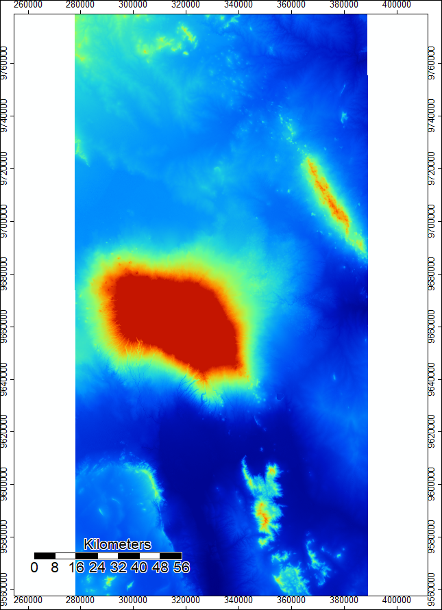 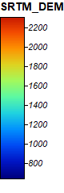

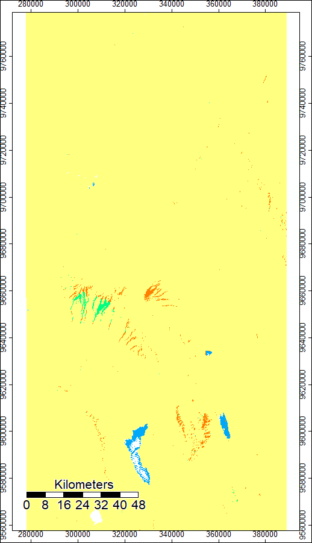 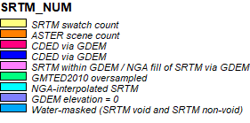

# And here are the ASTER Files:

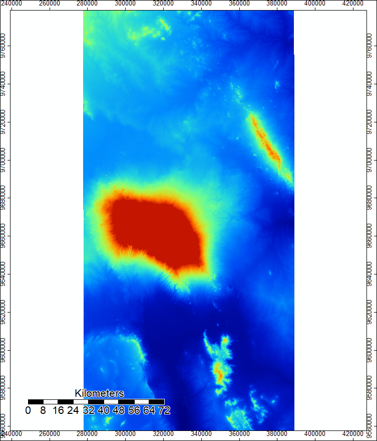 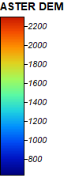

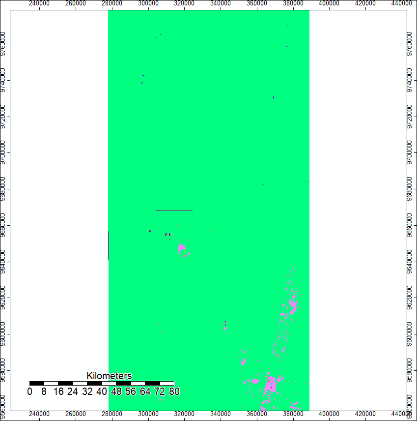 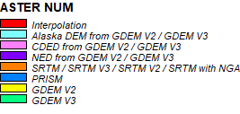

After reprojecting the data, we are able to look at the difference in elevation between the ASTER DEM files and the SRTM DEM files. I used the "Grid Difference" tool in Saga to preform this step.

# Here is the SRTM data subtracted from the ASTER Data:

.png) _legend.png)

After the preliminary steps, I preformed a hillshade analysis using the [hillshade batch script](Hillshade.bat).

# Here is the hillshade analysis of Mt. Kilomanjaro using the batch script with SRTM data:

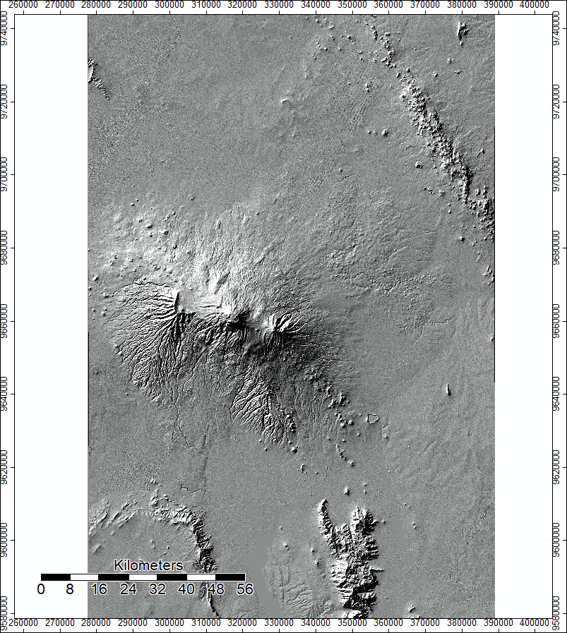 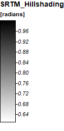

# Here is the hillshade analysis of Mt. Kilomanjaro using the ASTER data:

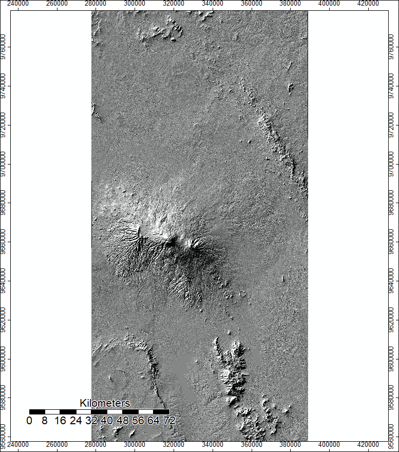 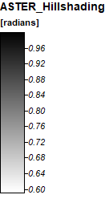

Next, I wrote a batch script to preform a hydrological analysis of Mt. Kilomanjaro. The functions preformed in this script mirror the functions from Lab 03. Here is the [channel network batch script](ChannelNetworkSRTM.bat) I wrote to preform the hydrological analysis of Mt. Kilomanjaro.

