## Lab 04

In Lab 4, I used batch script files in Notepadd++ to preform the same hydrological analysis as Lab 3. To start, I downloaded the DEM files and the NUM files for both [SRTM data](https://doi.org/10.5067/MEaSUREs/SRTM/SRTMGL1.003) and [ASTER data](https://doi.org/10.5067/ASTER/ASTGTM.003) from [EarthData Search](https://earthdata.nasa.gov/). The DEM file (Digital Elevation Model) contains elevation data in a raster layer. The NUM files contains the source of each data point in the DEM file, also displayed as a raster layer (for example, the orange areas in the SRTM NUM file represents DEM data sourced from ASTER data). 

 For a more detailed account of how I downloaded the data, please see the first paragraph of my [Lab 03 Documentation](Lab03.md)

The prilimiary steps in the hydrological analysis were to mosaick the two tiles together into one grid, and then reproject the mosaicked grid into the UTM projection. I used a batch script to preform these functions. I then opened the files in Sage version 6.2 so I could visualize and further analyze the data.

# Here are the SRTM DEM Files:

 

 

# And here are the ASTER Files:

 

 

The SRTM NUM file shows that elevation data from the western region of the mountain was sourced from the ASTER data set. Furthermore, the SRTM NUM file shows that the data includes water-masked areas south of Mt. Kilimanjaro.  

After reprojecting the data, we are able to look at the difference in elevation data between the ASTER DEM files and the SRTM DEM files. I used the "Grid Difference" tool in Saga to preform this step. The whiter regions represent areas where ASTER data reports a higher elevation than the SRTM data, and the darker blue areas represent regions where SRTM data reports a higher elevation than the ASTER data.

# Here is the SRTM data subtracted from the ASTER Data:

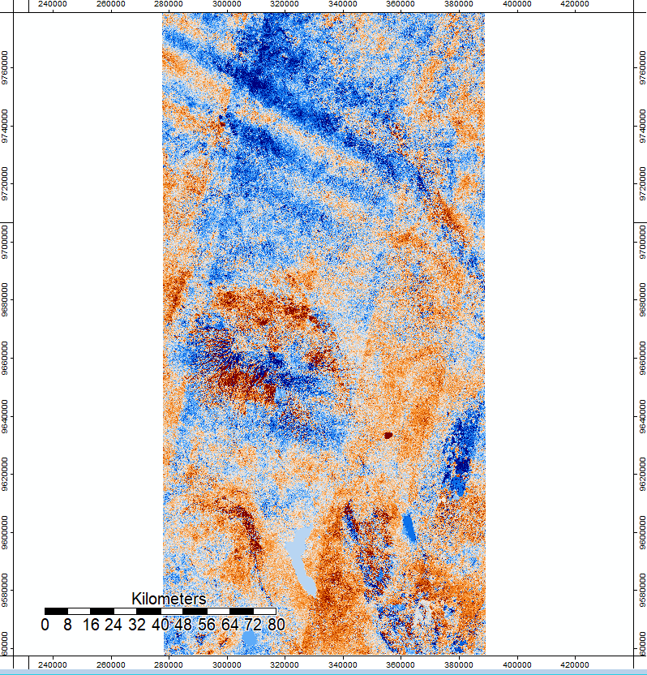 

After the preliminary steps, I preformed a hillshade analysis using the [hillshade batch script](Hillshade.bat). To help visualize the findings, I zoomed in on the map on a focus region on the Western side of the mountain. 
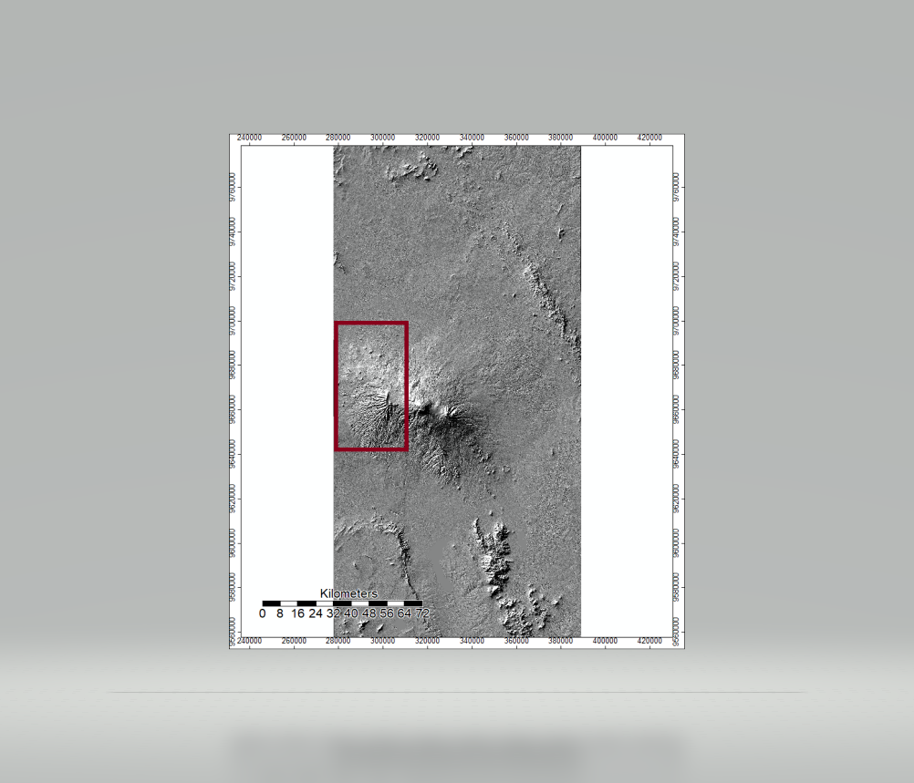

# Here is the hillshade analysis of Mt. Kilimanjaro using the batch script with SRTM data:

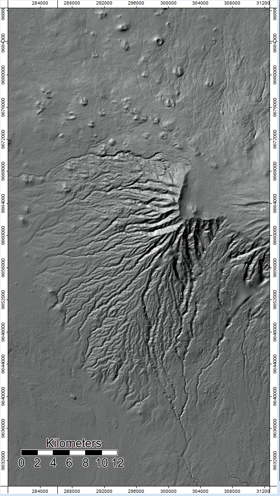

# Here is the hillshade analysis of Mt. Kilimanjaro using the ASTER data

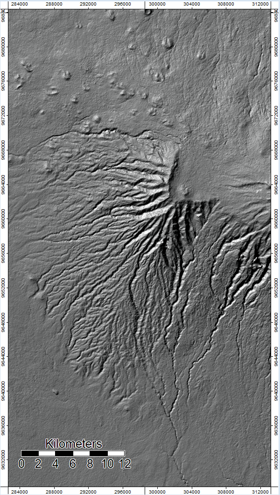

There is no noticable difference between ASTER data and SRTM data in the hillshade analysis.

Next, I wrote a batch script to preform a hydrological analysis of Mt. Kilimanjaro. The batch script allows the user to preform all the steps in the hydrological analysis in one step, and the functions preformed in this script mirror the functions from Lab 03. Here is the [channel network batch script](ChannelNetworkSRTM.bat) I wrote to preform the hydrological analysis of Mt. Kilimanjaro.The batch script still produces SAGA files for each function in the code, which is helpful so we can further analyze the differences between the ASTER data and the SRTM data.

# Here is the difference in flow accumulation represented by SRTM data subtracted from ASTER data: 
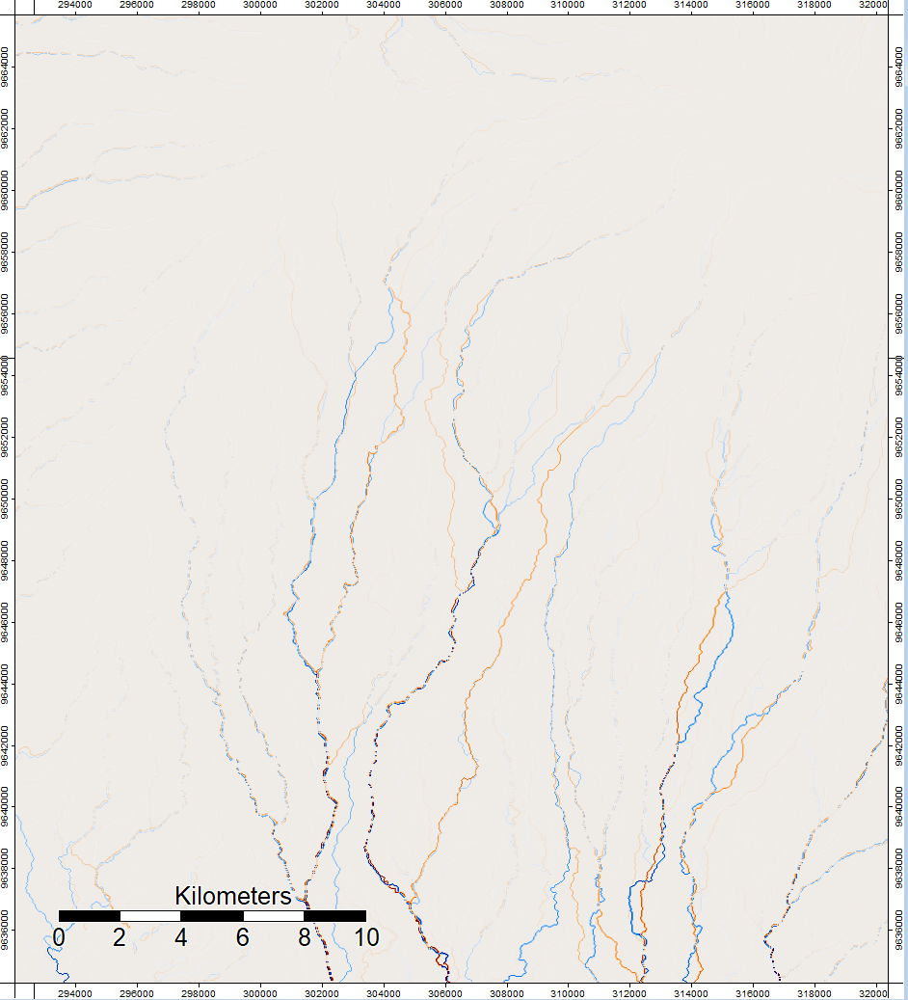 

# Here is the respective NUM files for the selected area: 
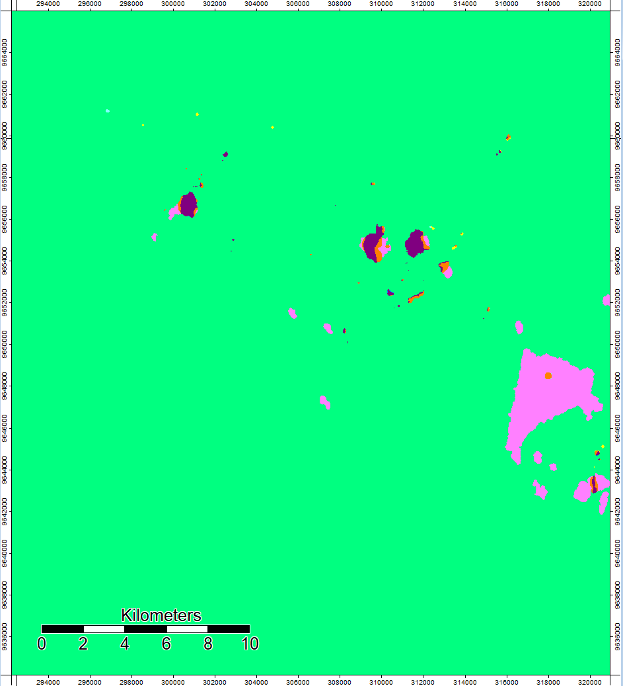

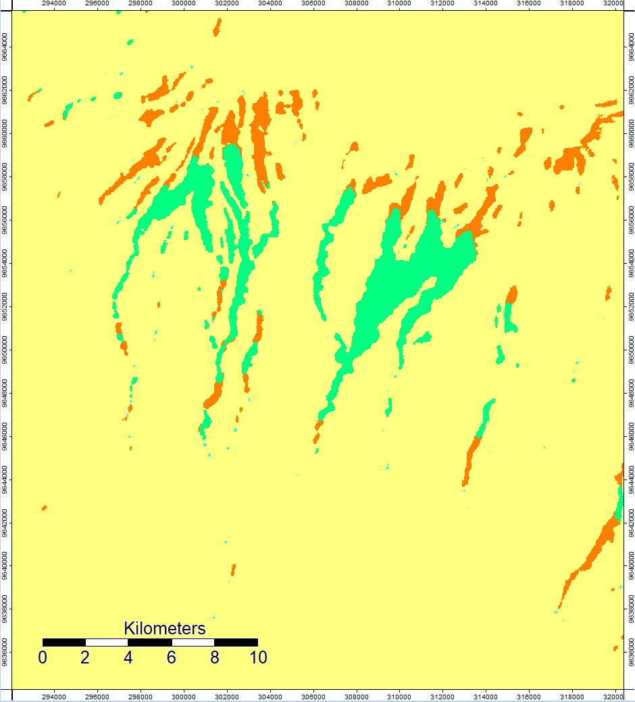

In this region....

The final product of the batch scripts is the channel network. 

# Here is the channel network of Mt. Kilimanjaro using SRTM data in 2D and 3D:

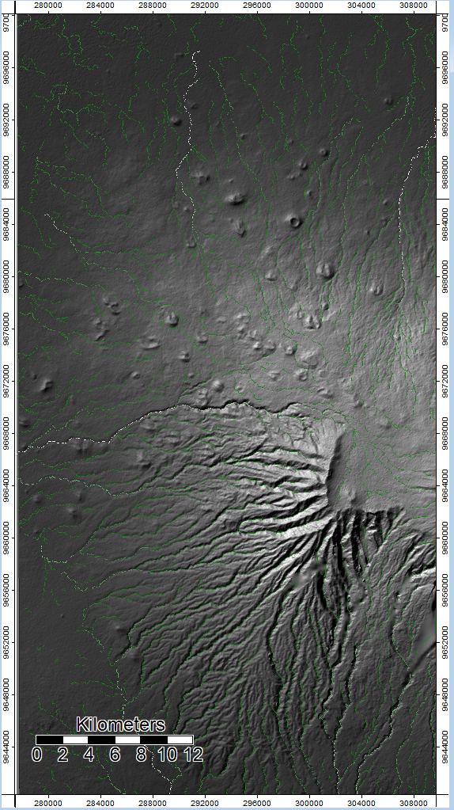 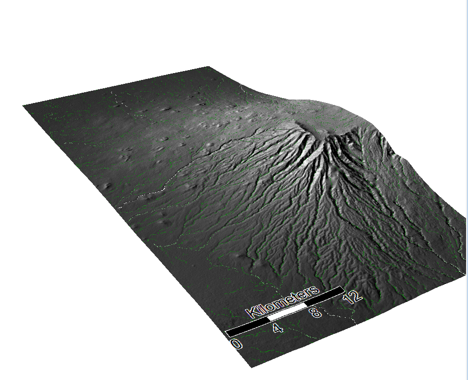
# Here is the channel network of Mt. Kilimanjaro using ASTER data in 2D and 3D:

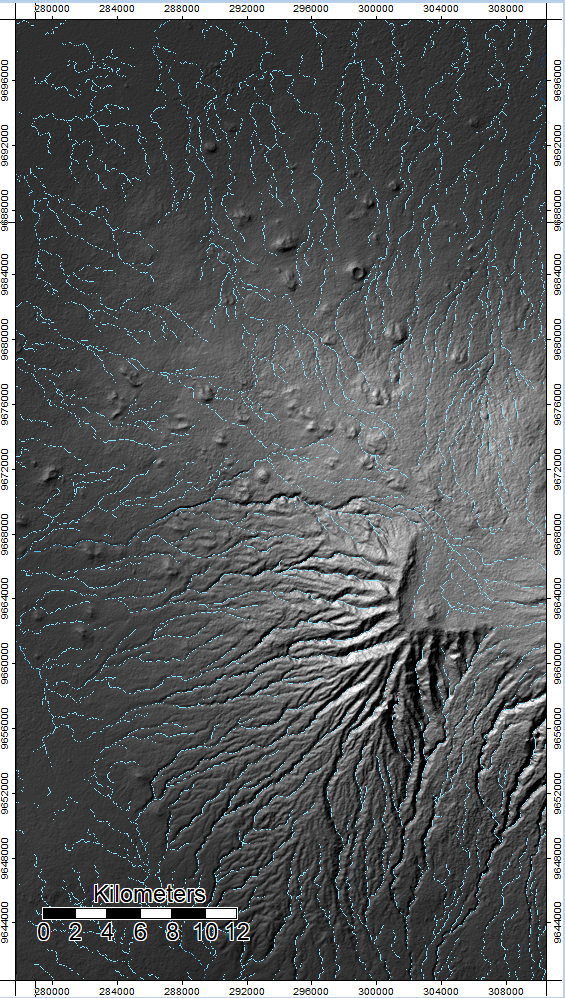 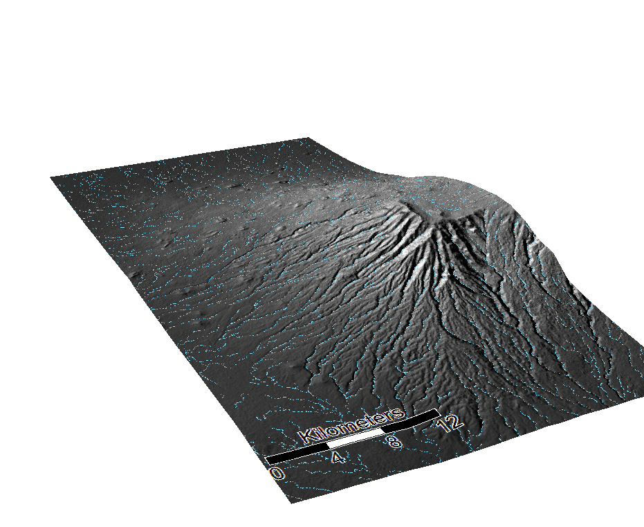 

Citations:

Data:
NASA/METI/AIST/Japan Spacesystems, and U.S./Japan ASTER Science Team. ASTER Global Digital Elevation
Model V003. 2019, distributed by NASA EOSDIS Land Processes DAAC,
https://doi.org/10.5067/ASTER/ASTGTM.003.
NASA JPL. NASA Shuttle Radar Topography Mission Global 1 arc second. 2013, distributed by NASA EOSDIS
Land Processes DAAC, https://doi.org/10.5067/MEaSUREs/SRTM/SRTMGL1.003.

