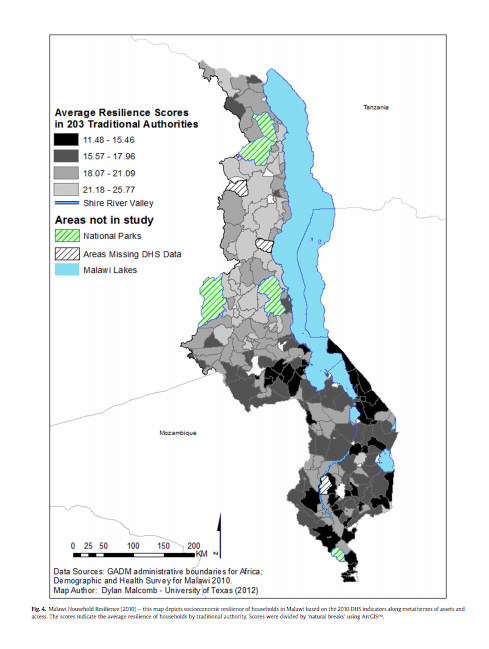

# Lab 07 & Lab 08: Malawi Vulnerability Assessment: Looking at Reproducibility and Replicability

The goals of this lab are to test the reproducability of a multi-criteria analysis of vulnerability in Malawi based off the paper by [Malcolm, D.W., E.A. Weaver, and A. R. Krakowka, 2014](Vulnerability modeling for sub-Saharan Africa An operationalized approach in Malawi.pdf).

We hope to replicate  and 80% of [Figure 5](Screen Shot 2019-12-10 at 10.56.34 AM.png) since we are unable to access 20% of the data used for this map in our time span. 

The data for this lab is attached [here](mwi_data.zip).

Authors:
Timing:
CRS:
EXTENT:
Spatial Resolution:
Uncertainty & Sampling:

# Methodolgy

# Step 1

Load UNEP Global Risk data into PostGIS
1. From the UNEP folder in the mwi_data.zip file, download the .tif files for estimated flood risk for flood hazard and the exposition to drought events.
2. Create a batch script for running this [program](raster2pgsql) in order to convert the raster data into SQL code. Save the file in the same location as the .tif files, add appropriate flags ("-s," "-t," "-d"), and then end the command line with the name of the raster tif, the table name, and the name of the SQL file (nameofraster.tif public.tablename > nameofSQLfile.sql).
3. Run program! A SQL file should have been created. If so, add another line in the batch script for another raster. 
4. Load the SQL files of rasters into database.  

