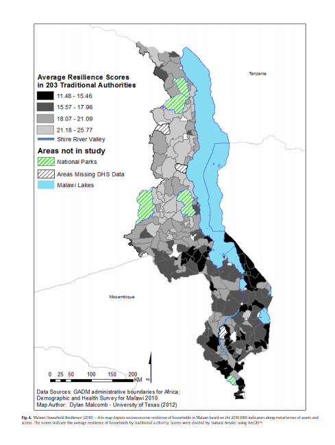
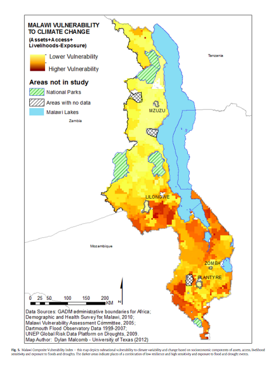
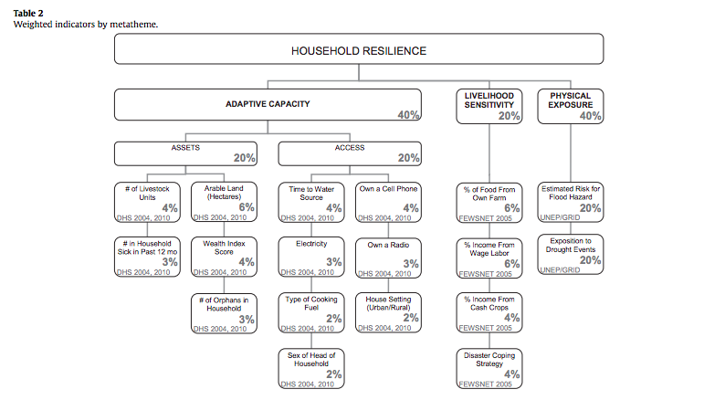
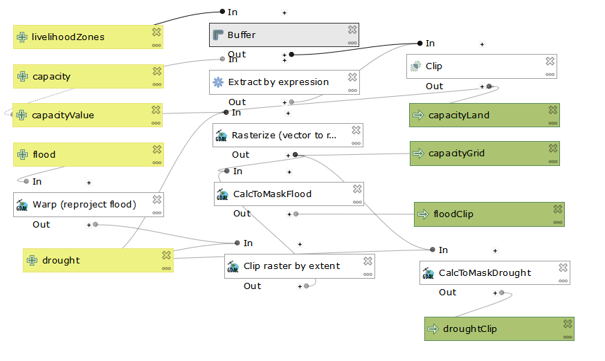
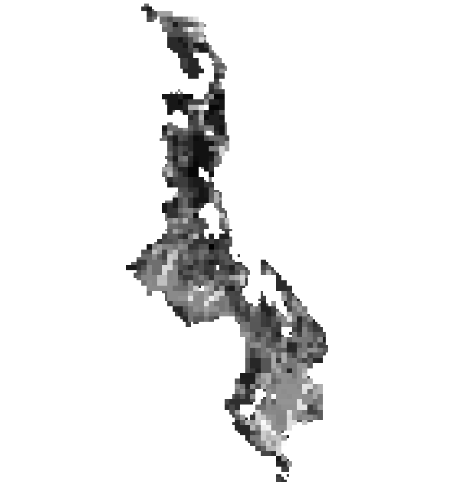
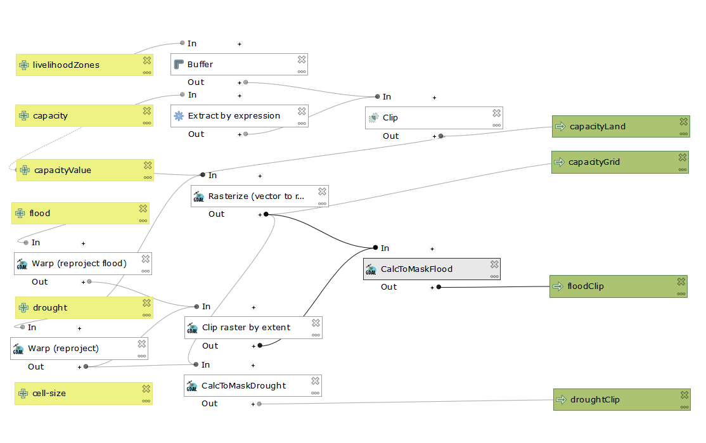
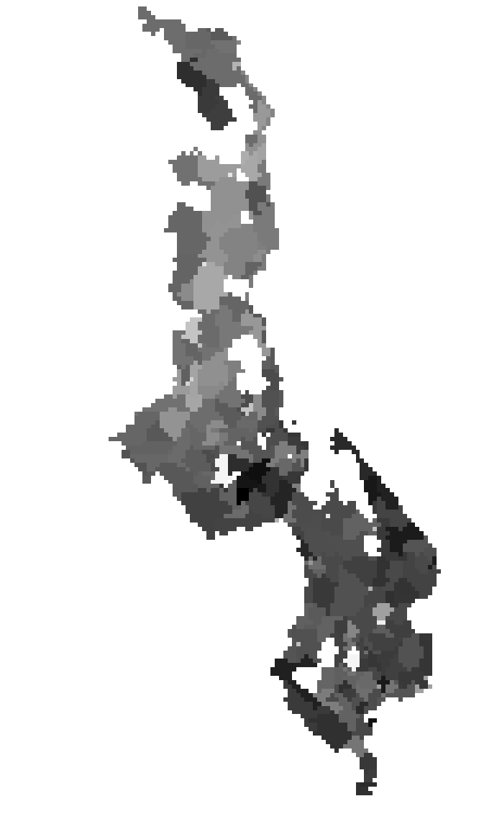

# Lab 07 & Lab 08: Malawi Vulnerability Assessment: Looking at Reproducibility and Replicability

The goals of this lab are to test the reproducability of a multi-criteria analysis of vulnerability in Malawi based off the methodology outlined in this paper by [Malcolm, Weaver, and Krakowka, 2014](VulnerabilityMalcolm.pdf).

#Goals
Replicate Figure 4
Replicate 80% of Figure 5 - we are unable to access 20% of the data used for this map in our time span. We hope to replicate what we can given the accessible data.  

# Data

Demographic Health Surveys - conducted by the U.S. Agency for International Development (USAID) from 2004-2010
Traditional Authority Tracts
Flood Risk and Exposure to Drought from the UNEP Global Risk
Malawi Shapefile

# Malcolm et. al's Methodolgy

# Our attempt to reproduce Figure 4

The DHS surveys are available to people after an application process. Our professor, Joe Holler, received the DHS survey data, however, due to due to the privacy regulations around the data, the students were not able to work with the data. However, each student in the class was assigned a variable from the table above to write an SQL code to classify the DHS survey data into quantiles. Professor Holler then accumulated our work into this [SQL code](vulnerabilitySQL (1).sql). This SQL file will, in theory, produce a figure that resembles Figure 4. in Malcolm, et al.'s vulnerability analysis.

# Our attempt to reproduce Figure 5

To reproduce Figure 5 in which Malcolm et al. produced a map of vunerability to climate change, we used this [model](vulnerability.model3) to calculate vulnerability created by our professor, Joe Holler. 

Below is a screen shot of the working model:

The model above creates the map below:

In Malcolm's Figure 5, it is evident that Malcolm used a smaller cell size (0.416666) rather then the bigger cell size we used in our model (0.833333). Therefore, in order to replicate Malcolm's outcomes, I added a parameter in the model to allow the user to input a cell size. Below is a screen shot of the working model with the added parameter:

With the cell size set to .416666, the model above creates the map below:

# Discussion

Cell Size: Malcolm et al. used a cell size of 0.416666, which does not match the cell size of the traditional authorities layer. Therefore, this would produce an error seeing as Malcolm added specificity to data which didn't actually exist in the layer. Our map, with a cell size of 0.8333 retains the integrity of the original data.

