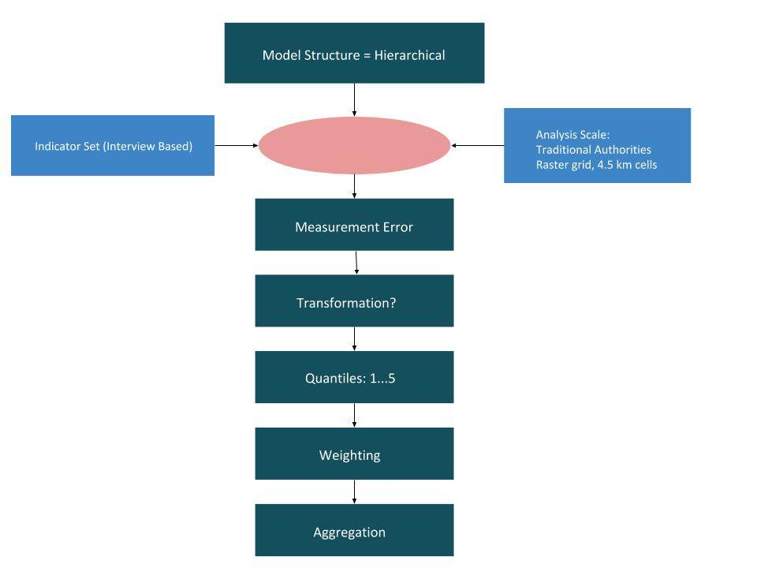
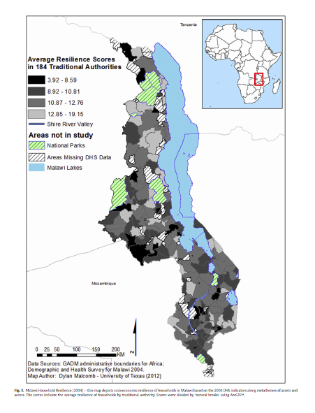
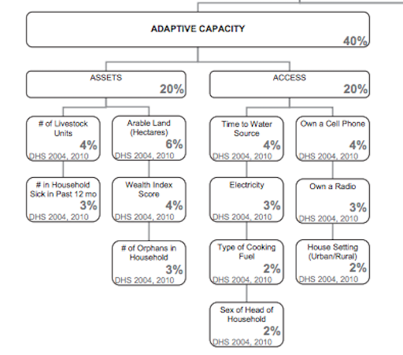

# Lab 07 & Lab 08: Malawi Vulnerability Assessment: Looking at Reproducibility and Replicability


The goals of this lab are to test the reproducability of a multi-criteria analysis of vulnerability in Malawi by [Malcolm, Weaver, and Krakowka, 2014](VulnerabilityMalcolm.pdf).

# Data

Demographic Health Surveys - conducted by the U.S. Agency for International Development (USAID) from 2004-2010

Flood Risk and Exposure to Drought from the UNEP Global Risk

FEWSnet Livelihood Data - 2005

# Goals 

In order to conceptalize Malcomb et al.'s method, we sketched a workflow in class. Below is an image of the workflow:



# Replicating Figure 4
Our goal for this lab was to recreate Figure 4, which shows the average resilience score in the traditional authorities. The first Figure 4 shows data from 2004, and the second Figure 4 shows data from 2010. 




The first step in Malcomb's multi-criteria vulnerability analysis was to calculate the "adaptative capacity" score, which will account for 40% of the Household Resilience score in the final calculation. The adaptative capacity score is a combination of assets and access in each household, and was calculated using the data from the DHS surveys. For each category in the DHS survey, the data was assigned a value of 1 through 5. The values were weighted according to the following figure:



The DHS surveys are only available to people after an application process. Our professor, Joe Holler, applied and received the DHS survey data, however, due to due to the privacy regulations around the data, we were not able to work directly with the data. However, each student in the class was assigned a variable from the figure above to write an SQL code to classify the DHS survey data into quantiles. Professor Holler then accumulated our work into this [SQL code](vulnerabilitySQL (1).sql). This SQL file will, in theory, produce a figure that resembles Figure 4. in Malcolm, et al.'s vulnerability analysis.

Here is a sample of our sql code:
```sql
ALTER TABLE dhshh ADD COLUMN orphans REAL;
UPDATE dhshh set orphans=pctr from
(SELECT hhid as shhid, percent_rank() OVER(ORDER BY hv251 desc) * 4 + 1 as pctr FROM dhshh ) as subq
where hhid=shhid;
```

Below is the resulting map:


# Replicating Figure 5

Unfortunately, we were unable to find the FEWSnet Livelihood data. Therefore, we are only able to create 80% of Malcomb's final vulnerability criteria from the adaptive capacity scores calculated from the DHS surveys (40%) and the physical exposure from the UNEP Global Risk (20%). 

This is Malcolm et al.'s Figure 5 shows the Malawi Vulnerability to climate change by adding up assets, access, livelihoods, and then subtracting exposure. In the previous analysis for adaptative capacity, a high adaptative capacity score indicates low vulnerability. However, a high value for physical exposure would suggest high vulnerability. Therefore, the physical exposure value is subtracted from the adaptative capacity score to keep the true meaning of values in the process of aggregating the data. 


I downloaded the flood risk and drought risk layers from the UNEP Global Risk data into QGIS. In order to insure that both drought and flood risk layers would have the same extent, we used GDAL Wrap tool to set the extent of one layer, and then used GDAL Wrap again to force the other layer to use the same extent as the first layer. We also used GDAL Wrap to rasterize the adaptive capacity layer. I then used this [model](vulnerability.model3) created by our professor, Joe Holler, to calculate the vulnerability for each layer. After running the model and saving the outputs, I used the functions GRASS r.Quantile and GRASS r.Recode to reclassify the drought and flood layer to quantiles.  Now, the drought layer, the flood layer, and the adaptive capacity layer are both quantiled, rasterized, and share the same extent. I used Raster Calculator tool in QGIS to calculate the vulnerability scores according to Malcomb et al.'s weighting.  

Below is a screen shot of the working model:


The model above creates the map below:


In Malcolm's Figure 5, it is evident that Malcolm used a smaller cell size (0.416666) rather then the bigger cell size we used in our model (0.833333). Therefore, in order to replicate Malcolm's outcomes, I added a parameter in the model to allow the user to input a cell size. Below is a screen shot of the working model with the added parameter:


# Discussion


Cell Size: Malcolm et al. used a cell size of 0.416666, which does not match the cell size of the traditional authorities layer. Therefore, this would produce an error seeing as Malcolm added specificity to data which didn't actually exist in the layer. Our map, with a cell size of 0.8333 retains the integrity of the original data.

Quantiles: Malcolmb et al. stated that each DHS survey category was broken into quantiles, meaning the scores in each category were assigned a value from 1 through 5. Lower values represent low resiliency/more vulnerability, and high values represent high resiliency/low vulnerability. As a class, we could not figure out how Malcomb assigned quantile scores to boolean data. For example, the category "owns a cell phone" is boolean data because the answers consist of either "yes" or "no." Grouping "yes" or "no" data into quantiles is not logical. No where in the paper did Malcolmb explicity explain how boolean data was incorporated into the adaptative capacity scores. Furthermore, one of my classmates, [Robert Kelley](https://rmkelley.github.io/) mentioned that Malcolmb et al. mentioned the use of quantiles, implying 1 - 5 grouping, but in another section of the paper mentioned grouping the data from 0-5. This sort of detail is crucial for the reproducibility of the study. 


