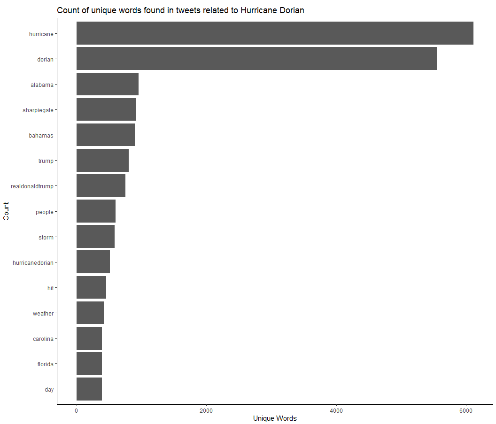
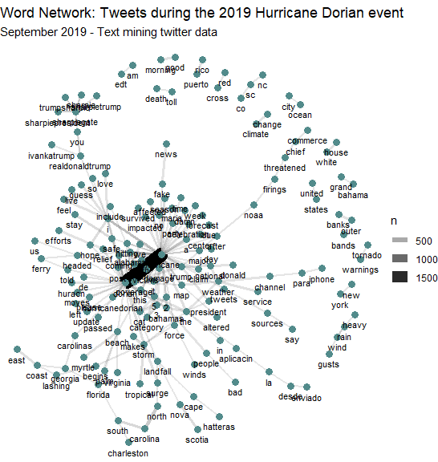

## Lab 09: Spatial Twitter Analysis For Hurricanes

For this lab, we want to explore the twitter activity in response to Hurrican Dorian, looking at both the real path of the hurricane and the path defined by President Trump. Our research question was: Is there a difference in twitter activity regarding Hurricane Dorian in the actual hurricane path or the path outlined by President Trump (commonly referred to ask "sharpiegate")?

To collect our data, we used a code written by our professor, Joe Holler. Professor Holler wrote a script in R Studio, which can be downloaded [here](Lab09_RScript_Final.R). The script is divided into three sections labeled clearly within the R Studio script. The first section contains the code used to gather the Twitter data. The second section contains the code to upload the twitter data to our PostGIS database. The third section contains the code used for the textual analysis in R Studio, specifically code to find the common language and word associations in tweets. We used a Twitter API to collect 200,000 tweets from September 11, 2019 containing the words "dorian," "hurricane," or "sharpiegate." We also downloaded a 200,000 tweets from November 19, 2019 as a control to understand the baseline twitter activity in the Eastern United States. I have attached the list of Twitter usernames found in our data: [november data](november.csv) and [dorian data](dorian.csv), but this link does not include the actual tweet content out of respect for the Twitter privacy policy. 

# Common Language

# Word Associatoins

# Heat Map / Kernel Density Map of Twitter Activity

# Choropleth Map of Tweet Normalized Difference

