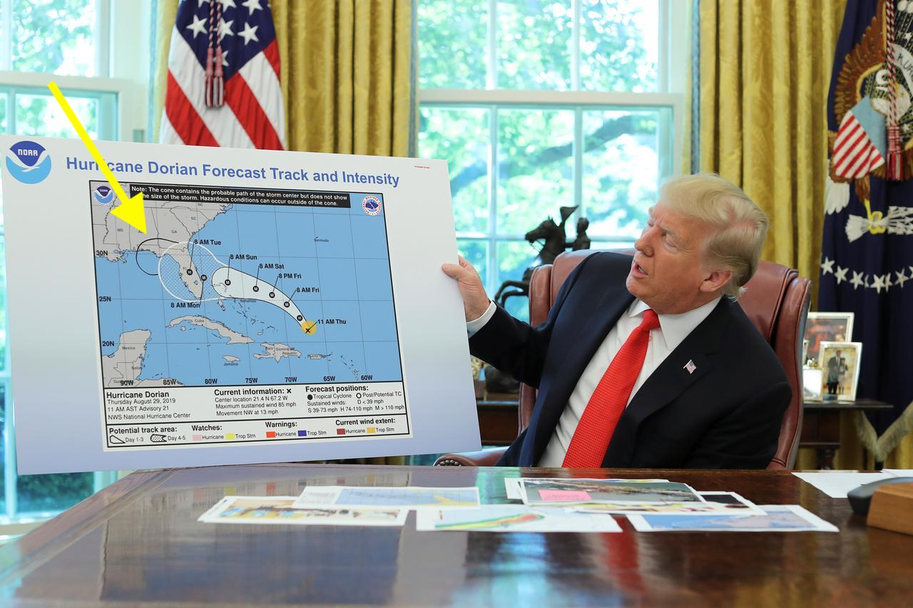
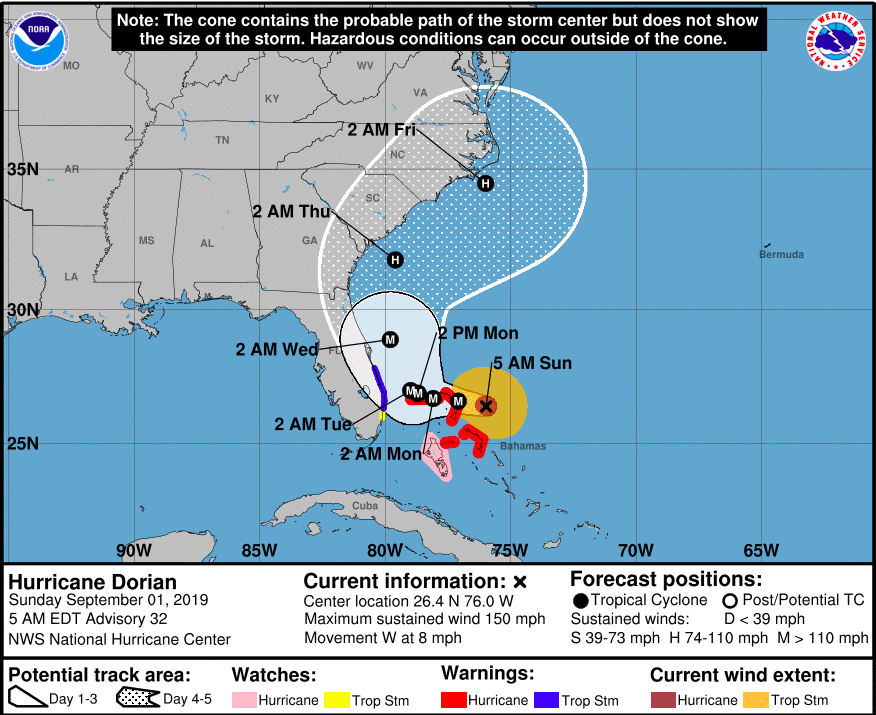
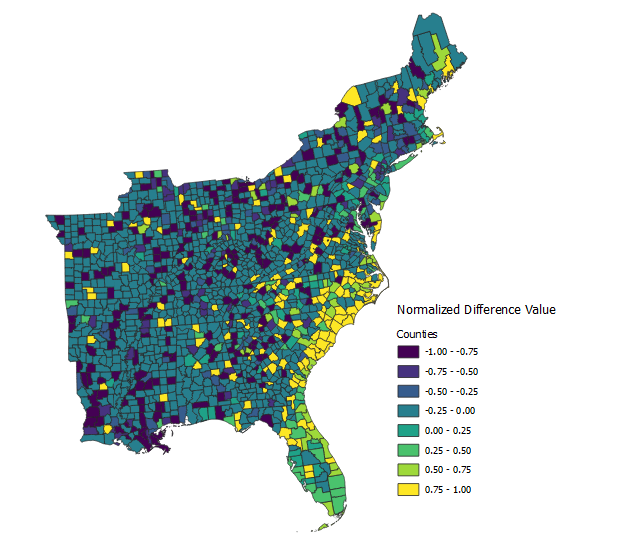
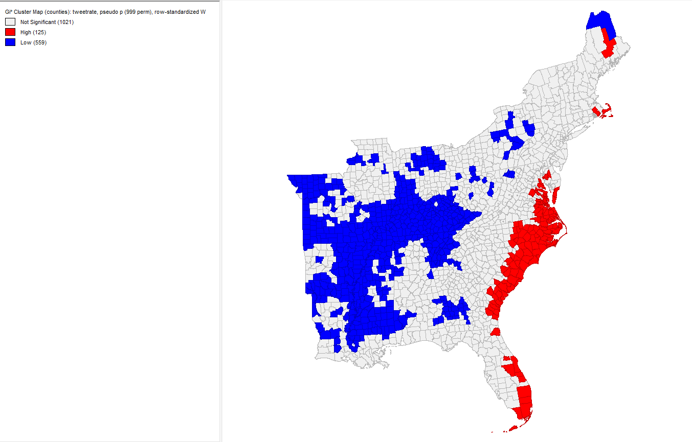
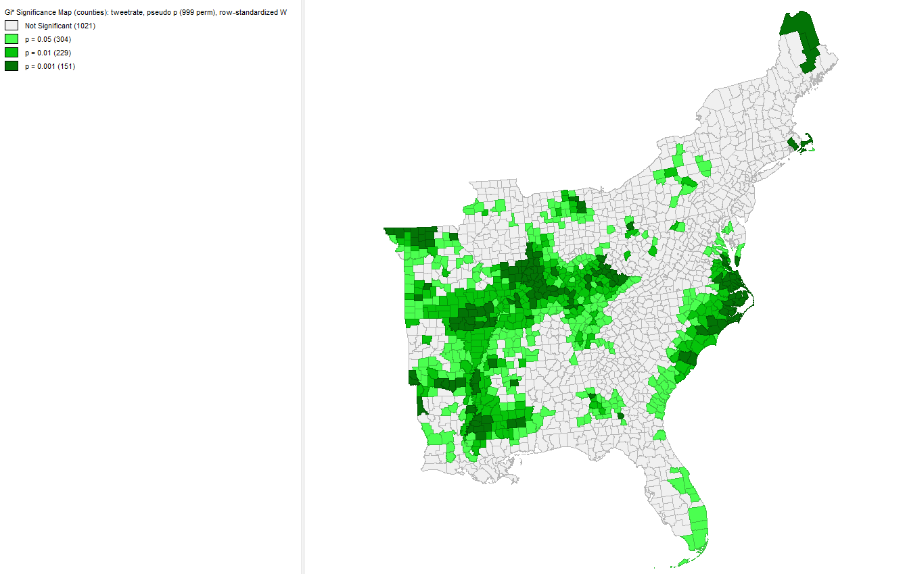

## Lab 09: Spatial Twitter Analysis For Hurricanes

For this lab, we want to explore the twitter activity in response to Hurrican Dorian, looking at both the real path of the hurricane and the path defined by President Trump. Our research question was: Is there a difference in twitter activity regarding Hurricane Dorian in the actual hurricane path or the path outlined by President Trump (commonly referred to ask "sharpiegate")?

This is a photo showing President Trump's map of Hurricane Dorian from [Reuters](reuters.com/article/us-sstorm-dorian-trump/sharpie-gate-continued-trump-doubles-down-on-dorians-aim-for-alabama-idUSKCN1VR027). The yellow arrow points to the added sharpie mark to Hurricane Dorian's path. 


This is a photo from NOAA showing the actual path of Hurricane Dorian downloaded from the [Port City Daily](https://portcitydaily.com/local-news/2019/09/01/hurricane-dorian-continues-its-track-with-models-showing-potential-impact-to-the-carolinas/). 


To collect our data, we used a code written by our professor, Joe Holler. Professor Holler wrote a script in R Studio, which can be downloaded [here](Lab09_RScript_Final.R). The script is divided into three sections labeled clearly within the R Studio script. The first section contains the code used to gather the Twitter data. The second section contains the code to upload the twitter data to our PostGIS database. The third section contains the code used for the textual analysis in R Studio, specifically code to find the common language and word associations in tweets. We used a Twitter API to collect 200,000 tweets from September 11, 2019 containing the words "dorian," "hurricane," or "sharpiegate." We also downloaded 200,000 tweets from November 19, 2019 as a control to understand the baseline twitter activity in the Eastern United States. I have attached the list of Twitter usernames found in our data: [november data](november.csv) and [dorian data](dorian.csv), but this link does not include the actual tweet content out of respect for the Twitter privacy policy. 

# Common Language


Using R studio, I preformed a textual analysis of the twitter content. After removing the stop words, which include words such as "the," "and," "or," etc, I found the most commonly used words throughout the Hurricane Dorian twitter data set. The above chart shows that the most commonly used words were "hurricane" and "dorian," which makes sense since each tweet must contain either "hurricane," "dorian," or "sharpiegate." The next five most commonly used words were "alabama," "sharpiegate," "bahamas," "trump," and the "realdonaldtrump." Four out of the top seven words included a reference to the Trump incident - "sharpiegate," "alabama", "trump," and "therealdonaltrump." This shows that tweeting about the Sharpiegate incident with Donald Trump was very popular among tweets related to Hurricane Dorian. 


The next analysis shows word associations that appear at least ten times throughout the twitter data set. The closer the words are to each other, the more times the words appear in the same tweet. The lines connecting the words show the number of times the words were used in the same tweet together. "Hurricane" and "Dorian" unsurprisingly had the strongest association. Immediately surrounding this word pair, other words commonly associated with hurricanes appear such as "survived," "affected," "damage," "coverage," and "impacted." Most notably, "dorian"-"hurricane" is connected to "alabama," which is connected to "trump," which is then connected to "donald." This shows the effect of Donald Trump's sharpie gate incident, in which he added Alabama to Hurricane Dorian's path. Other clumps of words make logical sense, such as "heavy"-"rain"-"wind"-"gusts" or "tornado"-"warnings." Words representing specific locations also appear in logical connections, such as "new"-"york" and "white"-"house." 


After I preformed the textual analysis in R Studio, I uploaded the data to my PostGIS database (the code for this work is attached in the R Script above). I then used SQL theory to preform a spatial analysis on the Twitter data. Here is the SQL code: [Labo9_SQL Code](lab09.sql). The steps are annotated below:

# Step 1
To preform this analysis, we need to use a projection system accurate across our focus region. We chose USA Continuous Lambert Conformal Conic Projection (SRS code is 102004), and used the PostGIS INSERT statement to load the projection system into our database. To double check if the insert worked, we ran this query:

```sql
Select * from spatial_ref_sys where srid = 102004
```

# Step 2
We then needed to transform our twitter data sets into the USA Continuous Lambert Conformal Conic Projection. We also want add point geometries to the twitter data sets. To preform this step, we used the "AddGeometryColumn" option in SQL theory.

```sql
SELECT AddGeometryColumn ('public', 'dorian','geom', 102004, 'POINT', 2, false)
UPDATE dorian
SET geom = st_transform( st_setsrid( st_makepoint(lng,lat),4326), 102004)

SELECT AddGeometryColumn ('public', 'nomber','geom', 102004, 'POINT', 2, false)
UPDATE november
SET geom = st_transform( st_setsrid( st_makepoint(lng,lat),4326), 102004)
```
 We transformed the counties data into the USA Continuous Lambert Conformal Conic Projection with this query:
 ```sql
 UPDATE counties SET geometry = st_transform(geometry,102004);
```

# Step 3

Next, we want to select for the United States counties we are interested in and delete the remaining counties. To preform this step, we used this SQL theory:

```sql
DELETE FROM counties
WHERE statefp NOT IN ('54', '51', '50', '47', '45', '44', '42', '39', '37',
'36', '34', '33', '29', '28', '25', '24', '23', '22', '21', '18', '17',
'13', '12', '11', '10', '09', '05', '01')
```
We now have a layer representing the november tweets, a layer representing the dorian tweets, and a layer with the Eastern United States counties. The map looks like this:


# Step 4

We now want to assign each twitter data point the corresponding county geoid. To preform this step, we will first add a text column of length 5 to the twitter data sets, and set the new column equal to the geoid of the county the twitter data intersects with. We will use the "st_intersect" function to preform this step. Below is the query:

```sql
UPDATE dorian
SET geoid = (SELECT GEOID from counties
WHERE st_intersects(geom, counties.geometry))

UPDATE november
SET geoid = (SELECT GEOID from counties
WHERE st_intersects(geom, counties.geometry))
```
 # Step 5
 Next, we want to count up the number of tweets per county. We add two new columns to the counties data set - one column will contain the number of november tweets per county and the other column will contain the number of dorian tweets per county. We use "Add Column" for this proecess. We then update the table and set the new column values equal to "0" to avoid null values in our data set. We then use "Group By" and "st_intersects" to count up the number of tweets per county. Below is the query for step 5: 

 ```sql
ALTER TABLE counties
ADD COLUMN novembercount integer 

ALTER TABLE counties
ADD COLUMN doriancount integer 

UPDATE counties
SET novembercount = 0 

UPDATE counties
SET doriancount = 0

UPDATE counties
SET novembercount = (SELECT COUNT(status_id)
FROM november
WHERE st_intersects(counties.geometry, november.geom)
GROUP BY geoid) 

UPDATE counties
SET doriancount = (SELECT COUNT(status_id)
FROM dorian
WHERE st_intersects(counties.geometry, dorian.geom)
GROUP BY geoid)
```

# Step 6
We now want to calculate the number of tweets per 10,000 people in each county. We use the equation (doriancount/population) * 10,000 to find the tweeter rate. 

```sql
ALTER TABLE counties
ADD COLUMN tweetrate real 
 
UPDATE counties
SET tweetrate = ((doriancount/"POP")*10000*1.0000)
```

Finally, we will calculate the normalized difference value (doriancount-novembercount)/(doriancount+novembercount) for each county using the following query:
```sql
ALTER TABLE counties 
ADD COLUMN ntdi real 

UPDATE counties
SET ntdi = (((doriancount - novembercount) *1.000)/((doriancount + novembercount) *1.000))
WHERE doriancount+novembercount >0
```

# Choropleth Map of the Normalized Difference between Dorian and November Tweets


We take the normalized difference in order to compare two nominal values (dorian tweets and november tweets). A high normalized difference value shows an increase in the number of tweets related to Hurricane Dorian above the baseline tweet level. States with a normalized value of zero show no change in number of tweets above baseline level, and tweets with a negative normalized value show a decrease in the number of tweets below the baseline during Hurricane Dorian. According to the above map, counties on the coast of North Carolina, South Carolina, Florida, Georgia, and some of Virginia have a high normalized difference value. Therefore, these states had an increased level of twitter activity related to Hurricane Dorian, and these states also fall into the real path of Hurricane Dorian.


# Visualizing the Results

To visualize our results, we used the software GeoDa. After connecting to my PostGIS database, I created a Weight Manager and set the weights field id variable equal to the geoid from the counties layer. I created a local G* cluster map and set the variable equal to the calculated tweet rate column. 




# Heat Map / Kernel Density Map of Twitter Activity

To make a kernal density map of the twitter data, we first find the centroid of the counties data set with the following query:
```sql
CREATE TABLE centroids AS
SELECT *, st_centroid(counties.geometry)
AS centroidscounty
FROM counties
```

After finding the centroids for each of the counties, I ran the "Heatmap(Kernel Density Estimation)" Algorithm in QGIS with the radius set to 100 km, the pixel size at 500, and the weight set to the tweeter rate column. Below is the result:

.PNG)

# Conclusion and Discussion

Twitter Conclusion

Discussion: The concept of using Twitter data to preform a textual and spatial analysis is both interesting and exciting. Moreover, this type of analysis is accessible to the public (after creating a Twitter Developer account). While exciting, we must reflect and be critical of this type of analysis in order to uphold the integrity of our work. The Twitter data we collected was onlyt geocoded if the user agreed to let Twitter access the user's location or if the user chose to disclose their neighborhood, city, county, state, or county on their personal twitter account. Therefore, there is potential error in self-identified locations by users, otherwise referred to as Voluntary Geographic Information [Elwood, Goodchild, and Sui](Researching Volunteered Geographic Information Spatial Data , Geographic Research , and New Social Practice Researching Volunteered Geo.pdf). This concept of Voluntary Geographic Information (VGI) ties into a larger discussion on what it means to use this type of information, how it should be used, and who should use it. As mentioned, this type of information is accessible to the public, which is increasing the number of individuals able and interested in preforming a spatial analysis using volunteered geographic information. While this is exciting to bring support and interest into the field of geogrpahy, this also means many invidiuals with no background in geographic theory may become engaged with spatial analyses. As Elwood et al. points out, inadequate understanding of geographic theory and principle can lead to major international problems. This discussion about who can use the volunteered geographic theory and how also ties into the discussion from lab 2 regarding GIS as a tool rather GIS as a science. In both topics, we consider what it means to "do geography" by using GIS or using VGI without knowledge in geographic theory and practice. 


