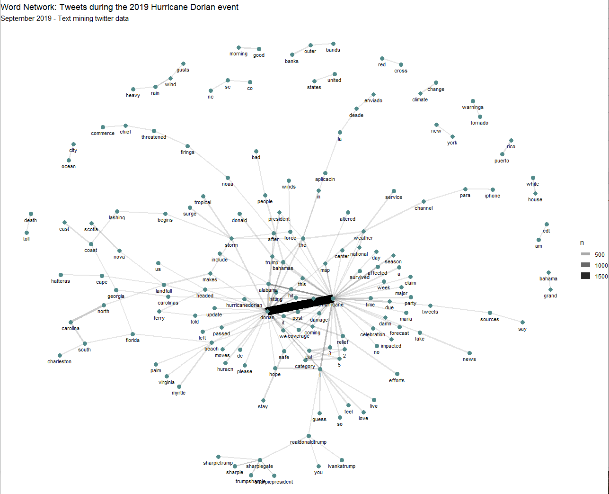
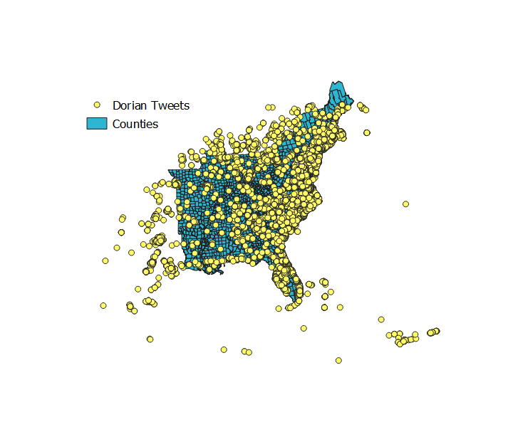
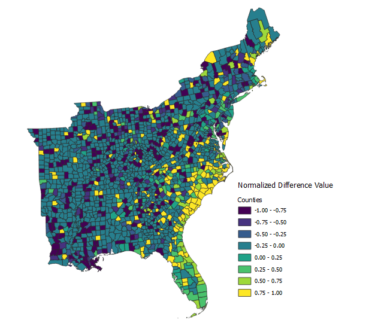

## Lab 09: Spatial Twitter Analysis For Hurricanes

For this lab, we want to explore the twitter activity in response to Hurrican Dorian, looking at both the real path of the hurricane and the path defined by President Trump. Our research question was: Is there a difference in twitter activity regarding Hurricane Dorian in the actual hurricane path or the path outlined by President Trump (commonly referred to ask "sharpiegate")?

To collect our data, we used a code written by our professor, Joe Holler. Professor Holler wrote a script in R Studio, which can be downloaded [here](Lab09_RScript_Final.R). The script is divided into three sections labeled clearly within the R Studio script. The first section contains the code used to gather the Twitter data. The second section contains the code to upload the twitter data to our PostGIS database. The third section contains the code used for the textual analysis in R Studio, specifically code to find the common language and word associations in tweets. We used a Twitter API to collect 200,000 tweets from September 11, 2019 containing the words "dorian," "hurricane," or "sharpiegate." We also downloaded a 200,000 tweets from November 19, 2019 as a control to understand the baseline twitter activity in the Eastern United States. I have attached the list of Twitter usernames found in our data: [november data](november.csv) and [dorian data](dorian.csv), but this link does not include the actual tweet content out of respect for the Twitter privacy policy. 

# Common Language


# Word Associations




After I preformed the textual analysis in R Studio, I uploaded the data to my PostGIS database (the code for this work is attached in the R Script above). I then used SQL theory to preform a spatial analysis on the Twitter data. Here is the SQL code: [Labo9_SQL Code](lab09.sql). The steps are annotated below:

# Step 1
To preform this analysis, we need to use a projection system accurate across our focus region. We chose USA Continuous Lambert Conformal Conic Projection (SRS code is 102004), and used the PostGIS INSERT statement to load the projection system into our database. To double check if the insert worked, we ran this query:

```sql
Select * from spatial_ref_sys where srid = 102004
```

# Step 2
We then needed to transform our twitter data sets into the USA Continuous Lambert Conformal Conic Projection. We also want add point geometries to the twitter data sets. To preform this step, we used the "AddGeometryColumn" option in SQL theory.

```sql
SELECT AddGeometryColumn ('public', 'dorian','geom', 102004, 'POINT', 2, false)
UPDATE dorian
SET geom = st_transform( st_setsrid( st_makepoint(lng,lat),4326), 102004)

SELECT AddGeometryColumn ('public', 'nomber','geom', 102004, 'POINT', 2, false)
UPDATE november
SET geom = st_transform( st_setsrid( st_makepoint(lng,lat),4326), 102004)
```
 We transformed the counties data into the USA Continuous Lambert Conformal Conic Projection with this query:
 ```sql
 UPDATE counties SET geometry = st_transform(geometry,102004);
```

# Step 3

Next, we want to select for the United States counties we are interested in and delete the remaining counties. To preform this step, we used this SQL theory:

```sql
DELETE FROM counties
WHERE statefp NOT IN ('54', '51', '50', '47', '45', '44', '42', '39', '37',
'36', '34', '33', '29', '28', '25', '24', '23', '22', '21', '18', '17',
'13', '12', '11', '10', '09', '05', '01')
```
We now have a map that looks like this:


# Step 4

We now want to assign each twitter data point the corresponding county geoid. To preform this step, we will first add a text column of length 5 to the twitter data sets, and set the new column equal to the geoid of the county the twitter data intersects with. We will use the "st_intersect" function to preform this step. Below is the query:

```sql
UPDATE dorian
SET geoid = (SELECT GEOID from counties
WHERE st_intersects(geom, counties.geometry))

UPDATE november
SET geoid = (SELECT GEOID from counties
WHERE st_intersects(geom, counties.geometry))
```
 # Step 5
 Next, we want to count up the number of tweets per county. We add two new columns to the counties data set - one column will contain the number of november tweets per county and the other column will contain the number of dorian tweets per county. We use "Add Column" for this proecess. We then update the table and set the new column values equal to "0" to avoid null values in our data set. We then use "Group By" and "st_intersects" to count up the number of tweets per county. Below is the query for this step 5: 

 ```sql
ALTER TABLE counties
ADD COLUMN novembercount integer 

ALTER TABLE counties
ADD COLUMN doriancount integer 

UPDATE counties
SET novembercount = 0 

UPDATE counties
SET doriancount = 0

UPDATE counties
SET novembercount = (SELECT COUNT(status_id)
FROM november
WHERE st_intersects(counties.geometry, november.geom)
GROUP BY geoid) 

UPDATE counties
SET doriancount = (SELECT COUNT(status_id)
FROM dorian
WHERE st_intersects(counties.geometry, dorian.geom)
GROUP BY geoid)
```

# Step 6
We now want to calculate the number of tweets per 10,000 people in each county. This will be our twitter rate. 
```sql
ALTER TABLE counties
ADD COLUMN tweetrate real 
 
UPDATE counties
SET tweetrate = ((doriancount/"POP")*10000*1.0000)
```

Finally, we will calculate the normalized difference value for each county using the following query:
```sql
ALTER TABLE counties 
ADD COLUMN ntdi real 

UPDATE counties
SET ntdi = (((doriancount - novembercount) *1.000)/((doriancount + novembercount) *1.000))
WHERE doriancount+novembercount >0
```
# Choropleth Map of Tweet Normalized Difference


# Heat Map / Kernel Density Map of Twitter Activity

To make a kernal density map of the twitter data, we first find the centroid of the counties data set with the following query:
```sql
CREATE TABLE centroids
SELECT *, st_centroid(geometry)
FROM counties
```


