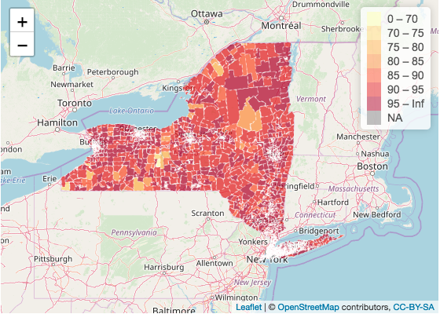
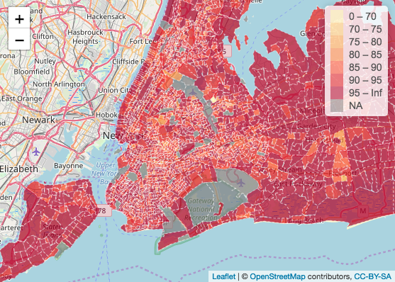
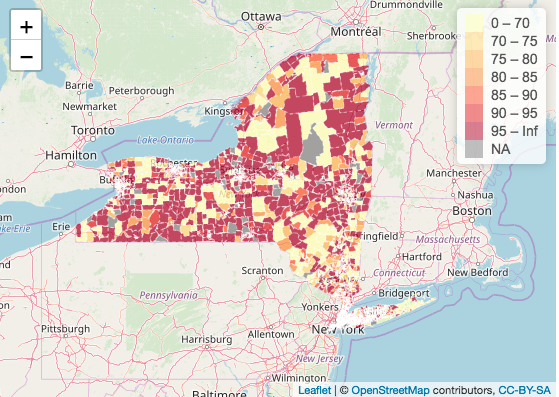
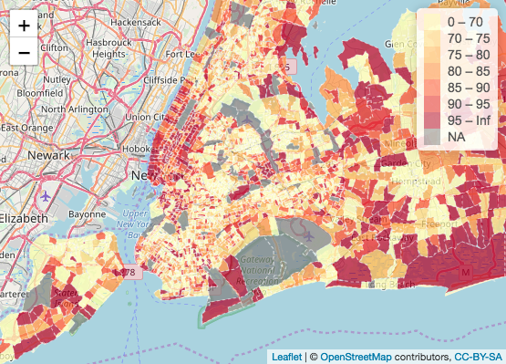
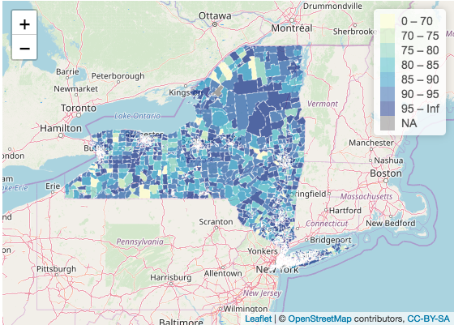
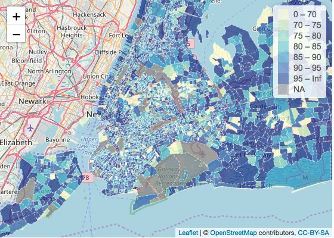
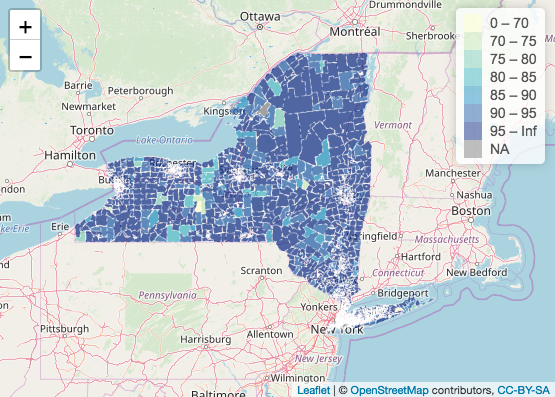
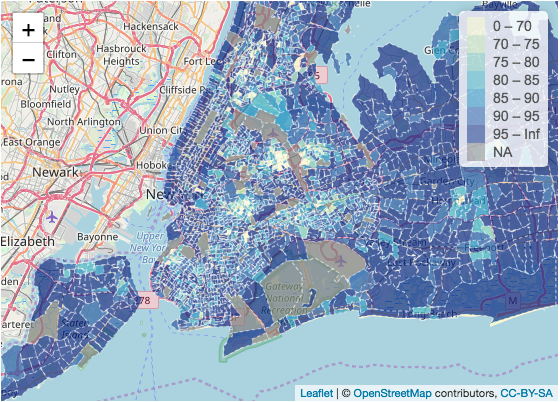

# My Final Project

Check out my Shiny app [here](https://haedrich.shinyapps.io/OpenSource/).

# Introduction

The goal of my final project is to investigate the rate of insurance coverage in the United States. I was inspired by [this episode](https://www.nytimes.com/2019/12/02/podcasts/the-daily/medicare.html) on [the Daily](https://www.nytimes.com/column/the-daily), a podcast produced by [the New York Times](https://www.nytimes.com/). The episode tells the story of a woman living in West Virgina who is getting sued by her local hospital over unpaid medical bills, even though the women has a full time job and insurance. After listening, I was motivated to investigate insurance coverage throughout New York state under the assumption that uninsured individuals are more vulnerable to compounding medical bills. Through my analysis, I was hoping to discover whether or not vulnerable populations exist within New York state (I picked New York state because I'm planning on moving there next fall). For this analysis, I examined the realtionship between citizenship status, income level, and medical debt in relation to insurance coverage across census tracts in New York state. This is a spatial analysis since I'm investigating how insurance rates, citizenship status, medical debt, and income interact and change throughout space in order to expose a pattern or trend. I will be done with my analysis when I have a map that shows the relationship between citizenship, insurance coverate rate, medical debt, and household income across New York state.
  For my analysis, I used the open source software, [R Studio](https://rstudio.com/), Version 1.2.1335. My Open Source GIS class used R Studio to analyze twitter data during Hurricane Dorian in [Lab 09 & Lab10](Lab09.md). Simultaneously, I learned how to code in R while taking [Introduction to Data Science](https://catalog.middlebury.edu/courses/view/course/course%2FMATH0216), however, we only learned very basic mapping techniques. I decided to use R Studio for this project so I could integrate my skills and knowledge culminated during Open Source GIS with my understanding of R Studio from Introduction to Data Science. 


# Data
 
I used [American Fact Finder](https://factfinder.census.gov/faces/nav/jsf/pages/index.xhtml) to find data from [the US Census Bureau](https://www.census.gov/) regarding insurance coverage in the United States as it relates to income level and citizenship status. I downloaded table S2701 from the [American Community Survey](https://factfinder.census.gov/faces/tableservices/jsf/pages/productview.xhtml?pid=ACS_17_5YR_S2701&prodType=table) from 2017. For the medical debt data, I downloaded the [data](Urban_Inst_Debt_In_America.xlsx) from the [Urban Institute](https://www.urban.org/). I navigated to the "Medical Debt" sheet and extracted the data for New York counties. The medical debt data did not have a GEOID column. I therefore downloaded a data set from the Federal Communications Commission, which included both the county data and GEOID data for New York state. 

To access the metadata, data, and help documentation, click [here](AACS_17_5YR_S2701)
To access the Urban Institute extracted data, click [here](debt_medical.xlsx) and click [here](Debt_in_America_Technical_Appendix.pdf) for the data appendix.
To access the county/GEOID data of New York State from the Federal Communications Commission, click [here](NewYork.csv)

# Method

After reading in the "ACS_17_5YR_S2701.csv" file, I extracted the relevant columns for my analysis using the following code:
```
insurance.2017.two <- insurance.2017[,c("GEO.id", "GEO.id2", "GEO.display-label", "HC03_EST_VC44", "HC03_EST_VC45", "HC03_EST_VC46","HC03_EST_VC47", "HC03_EST_VC75", "HC03_EST_VC76", "HC03_EST_VC77", "HC03_EST_VC78", "HC03_EST_VC79")]
```

I then renamed the columns to facilitate the code writing process. To rename a column, I used the below code:
```
names(insurance.2017.two)[4] <- "Native"
```

The U.S. Census bureau data has GEO id's attached the tract data, however, no spatial polygon information. I therefore used the function "tracts" found in the library "tigris" to download a spatial polygon dataframe for the census tracts of New York state. I have never used this package before, but I was excited at how simple and unproblematic the "tracts" function ran.

```
tracts <- tracts(state = 'NY', county = c(001...123), cb=TRUE)
````

I then needed to join the insurance data (referred to as "insurance.2017.two" in R script) to the tract spatial polygon layer. I used the geo_join function in the R script below:
 ```
 insurance.2017.merged<- geo_join(tracts, insurance.2017.two, "GEOID", "GEOID")
```
I now have a spatial polygon layer containing information about citizenship status and income as it relates to insurance coverage rate from the US Census Bureau. I then needed to upload the debt data from the Urban Institute (I named the data file "debt_medical.xlsx). I downloaded the data from the website and ran this code to upload the data into R Studio:
```
debt <- read_excel("debt_medical.xlsx")
```
I then read in the data containing county names and the respective GEOIDs with this code and renamed the columns appropriately:
```
codes <- read_csv("NewYork.csv")
```

I joined the debt data with the county-GEOID data with this code and renamed the columns appropriately:
```
join.fip <- left_join(debt,
                      codes,
                      by = "county")                  
````
I then preformed a geo_join (see above):
```
debt.merged <- geo_join(insurance.2017.merged2, join.fip, "GEOID", "GEOID")
```


Now, I had the appropriate cleaned data to use for my final maps. The final maps can be produced by using the above code in an R Script in R Studio. However, from  my intro to data science class, I had experience building Shiny Apps, a platform that allows users to interact data. I decided to put my final maps into a Shiny App so users could flip between panels -- one panel showing insurance coverage relative to citizenship status (options = native, foreign born, naturalized, and non-citizen), one panel showing insurance coverage relative to income (options = under 25,000, 25,000 - 49,999, 50,000 - 74,999, 75,000 - 99,999, and over 100,000), and one panel showing percent medical debt. In the first two panels, the user is able to select an option and then view the corresponding map. In the map of New York state, New York City is hard to distinguish since there are so many census tracts within the city. Therefore, I created a button which allows the user to zoom in on New York City by changing the extent and the zoom. 

# Visuals

To explore my Shiny App, download [the app](debtapp.R), [the US Census Bureau data](ACS_17_5YR_S2701.csv), [Urban Institute aata](debt_medical.xlsx), and the [FCC data]((NewYork.csv). Save the four files in the same location, open the app in R Studio, and hit run! Note: If you don't have R Studio on your computer, you can still use my app by clicking on the link at the top of this page!

# Here are some interesting visuals I found as I flipped through my Shiny App.

Below is a map showing percent of people born in the United States with insurance coverage by census tract New York state and New York City:





Below is a map showing percent of people who are not citizens of the United States with insurance coverage by census tract New York state and New York City:




Below is a map showing insurance coverage rate of households earning under 25,000k a year in New York state and New York City:




Below is a map showing insurance coverage rate of households earning over 100,000k a year in New York state and New York City:




# Conclusion

In the map showing the insurance coverage rate of people born in the United States, the overwhelming majority of census tracts report an insurance rate of over 85 percent. Exceptions include the two census tracts in the Center-East section of New York and a couple of census tracts in the Center-West section, all of which show insurance coverage below 85 percent. In the close-up of New York City, the large majority of census tracts report an insurance rate of over 95 percent, the highest category. 

In the map showing the insurance coverage rate of people who are not citizens of the United States, we understand a different story. The overwhelming color of both the New York state and the New York City map is light yellow representing an insurance coverage rate of less than 70%. Interestingly enough, in the New York state map, the insurance rate seems to be polarized - either the census tract has an insurance rate over 95 percent and above or the census tract has an insurance rate of 70% or below. This is interesting seeing as I would expect more of a gradient in insurance coverage rate across New York state. In the New York City map, areas in Manhattan still have a high insurance coverage rate, but overwhelmingly, non-U.S. citizens living in New York City report a rate of under 70 percent insurance coverage rate. 

In the blue maps, the insurance coverage rate of households earning under 25,000k a year is shown. The map is not particularly shocking until juxtaposed with a map reporting the insurance coverage rate of households earning over 100,000k a year. The comparison between under 25,000k income and over 100,000k income is particularly apparent in the map of New York City. While it's not surprising that households earning over 100,000k are insuranced, the difference between insurance coverage rate between the two household incomes is apparent. This shows that households earning 25,000k or below are more likely to not have insurance than houses earning 100,000k or above. These households may be more vulnerable to medical debts or even lawsuits by hospitals. 

# Discussion

In terms of "openness," I believe my final project process is open. Both R Studio and U.S. Census Bureau data are free, online sources. Moreover, these resources are accessible without barriers to entry or wait times. In addition, these resoruces are very popular, and therefore have a deep and thorough help documentation online. Examining insurance rates, citizenship status, and income can be done across different scales and regions, so long as accurate data can be downloaded for the boundaries and variables. 


# Error

  Originally, I hoped to make use of the "tidycensus" package built for R Studio. I originally read in the data from the American Community Surveys using the "get_acs" function after acquiring a CENSUS API key. However, I ran into a serious issue when I tried to interpret the column names. I compared data downloaded directly from the American Fact Finder website with the data downloaded with the get_acs function using the metadata to interpret column names. When I compared what should have been identical columns, the data did not match. I therefore decided to bypass the use of the get_acs function. Instead, I used the data direclty downloaded from the American Fact Finder website and uploaded the data into R Studio using the "read_csv" function. In my script, I have included my attempt at using the "get_acs" function, however, I have hashtagged the code so the code will not run in the app. I would also add that when I did use the "get_acs" function, the runtime was approximately 3-5 minutes to get the app up and running. When I downloaded the data onto my desktop, and used the "read_csv" file, my run time decreased to around 1 minute. Therefore, for my project, I believe uploaded the data using "read_csv" works better. 
   
   

# Citations

Application layout guide. (n.d.). Retrieved December 2019, from https://shiny.rstudio.com/articles/layout-guide.html.

Documentation - Leaflet - a JavaScript library for interactive maps. (n.d.). Retrieved December 2019, from https://leafletjs.com/reference-1.6.0.html.

Kumar, A. (2019, September 9). Learn R: How to Extract Rows and Columns From Data Frame - DZone Big Data. Retrieved 2019, from https://dzone.com/articles/learn-r-how-extract-rows.

U.S. Census Bureau, 2017. Selected characteristics of Health Insurance Cover in the United States,
2013-2017 American Community Survey 5-Year Estimates. Retreived from https://factfinder.census.gov/faces/tableservices/jsf/pages/productview.xhtml?pid=ACS_17_5YR_S2701&prodType=table. 

Zev@zevross.com. (2016, May 6). Manipulating and mapping US Census data in R using the acs, tigris and leaflet packages. Retrieved December 2019, from http://zevross.com/blog/2015/10/14/manipulating-and-mapping-us-census-data-in-r-using-the-acs-tigris-and-leaflet-packages-3/#census-data-the-easyer-way.
