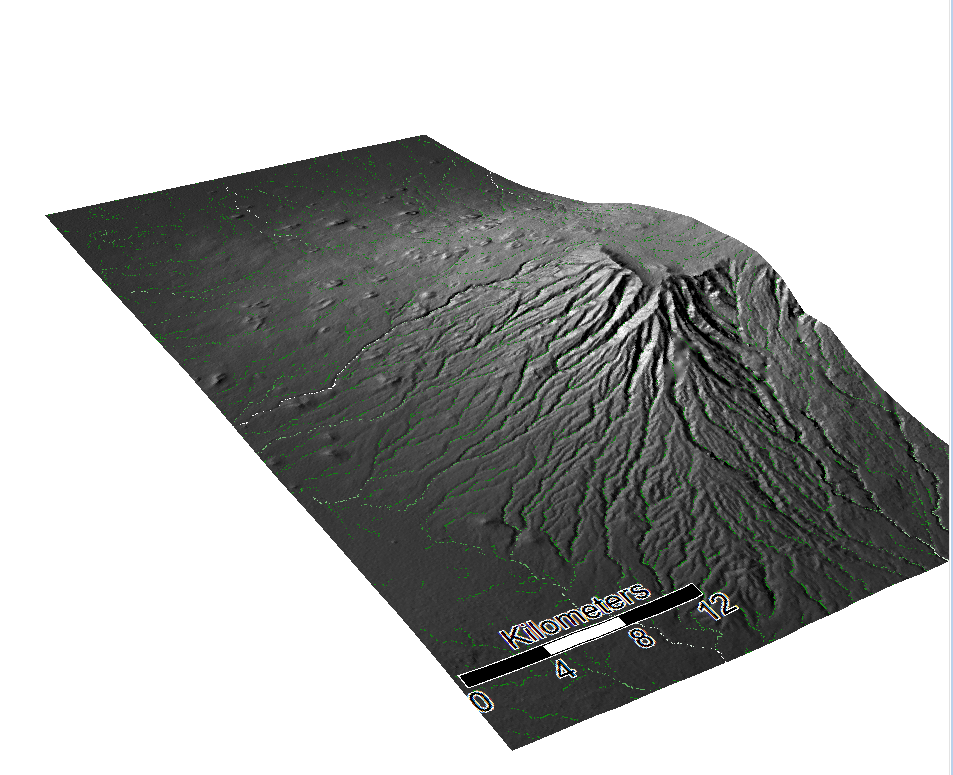

# Sarah Haedrich - GitHub Homepage

My name is Sarah Haedrich, and I'm currently a student at Middlebury College graduating in February of 2020. I'm majoring in environmental studies and geography. For my last geography class, I chose to learn about OpenSource GIS softwares in GEOG323 with Professor Joe Holler. Over the course of the semester, we worked with QGIS, R Studio, SAGA, and PostgreSQL among other softwares. This blog showcases my work in the course, broken down by lab exercises. 

[Article Review from Free and Open Source Software Conference 4G, 2019](blogpost1.md)

[Lab 01 & Lab02: QGIS Direction and Distance Model](lab02.md)
In lab 2, we worked in QGIS to create a model to calculate the direction and distance from polygons to a point. I used the model I created to look at median gross rent in comparison to distance and direction in El Paso Texas.

Median Gross Rent by census tract in El Paso

[Lab 03: Hydrological Analysis of Mt. Kilimanjaro](Lab03.md)
In lab 3, we worked in SAGA to create preform a hydrological analysis of Mt. Kilimanjaro using SRTM data from Earthdata Search. Our finished product is a channel network of the Mt. Kilimanjaro and the surrounding area. 

[Lab 04: Batch Scripts for Hydrological Analysis of Mt. Kilimanjaro](Lab04.md)
In lab 4, we wrote batch scripts for the hydrological analysis we completed in lab 3 using both SRTM data and ASTER data downloaded from Earthdata Search. We also used error analysis  

[Lab 05 & Lab06: Vulnerability Analysis in Dar es Saalam](lab05.md)
In lab 5 and 6, we designed a vulnerability analysis in analyze Dar es Saalam, Tanzania. My partner and I decided to look at the number of schools per ward in Dar es Saalam using data from the Tanzania Resilience Academy. 

[Lab 07 & Lab08: Vulnerability Analysis in Malawi](Lab08.md) 
In Lab 07 & Lab 08, our class investigated at reproducibility and replicability by attempting to reproduce a vulnerability analysis in Malawi.

[Lab09 & Lab10: Twitter Analysis in R Studio](Lab09.md)
In Lab 09 & Lab 10, our class preformed a textual and spatial analysis of Twitter data during Hurricane Dorian across the Eastern United States.

[Twitter Article Review](twitter.md)
Discussing reproducibility and replicability in a study using Twitter data.

[Final Project](final.md)
I looked at insurance coverage rates across New York state, with emphasis on New York City, relative to citizenship status, household income, and medical debt using R Studio. 
