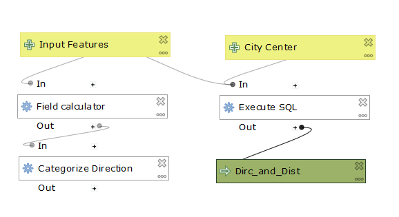
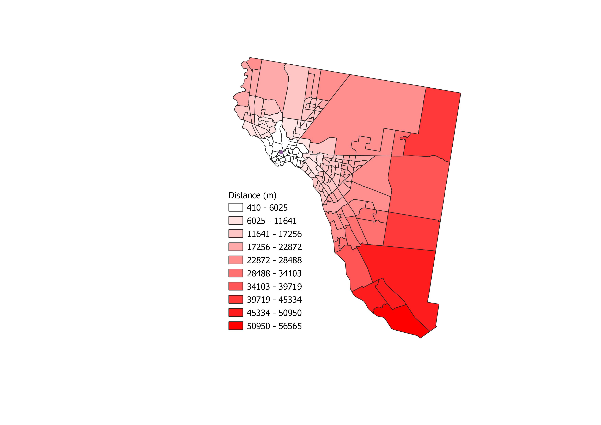
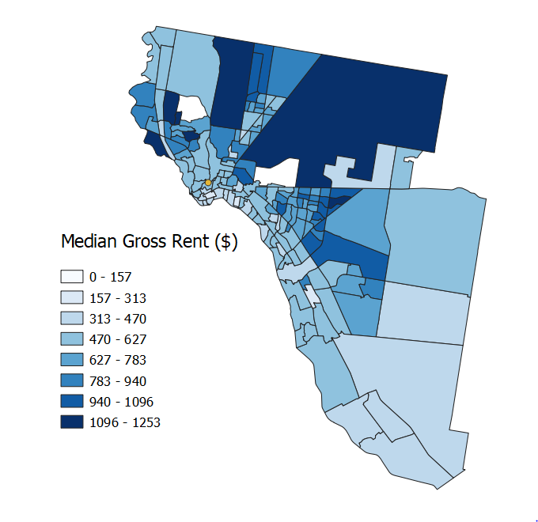
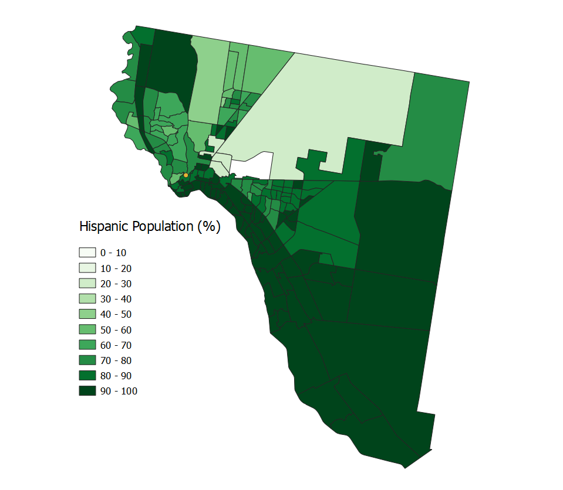

##  Lab 02: QGIS Direction and Distance Model

In the first lab, we created a model to calculate direction and distance from multiple polygons to a point. This type of model is helpful to find the direction and distance from selected census tracts to a Central Business District in a given city. I used the Execute SQL function in QGIS to preform the direction and distance functions. After finding the direction, I used field calculator to categorize the directions into North, East, South, and West. To text my model, I downloaded census tract data of EL Paso, Texas from the [U.S. Census Bureau American Fact Finder](https://factfinder.census.gov/faces/nav/jsf/pages/index.xhtml). I also downloaded census data for median gross rent and total latino population in El Paso, Texas to explore the relationship between these variables relative to distance and direction. The geopackages are linked below:

[El Paso Latino Population](Hispanic_Geopackage.gpkg)
[El Paso Median Gross Rent](MedianGrossRent_Geopackage.gpkg)
[El Paso Central Business District](El_Paso_CBD_Geopackage.gpkg)
[El Paso Census Tracts](El_Paso_Geopackage.gpkg)

Here is the data for this lab: [Data](Data_Lab02.md)

# Here is a screen shot of my working model:

# Here is a map displaying the distance of El Paso census tracts from a point representing the Central Business District (for this lab, I used an arbitrary point):

# Here is a map displaying the median gross rent of census tracts in El Paso:

# Here is a map displaying the density of the latino population by census tract in El Paso:

# Graphs with Data Plotly

To further explore the relationship between median gross rent relative to distance and direction, I used the Data Plotly plug-in in QGIS. The first graph represents direction versus media gross rent on a [polar plot](mgr_dirc.html) and the second graph representing distance versus median gross rent on a [scatter plot](dist_mgr.html). 

[Back to Main Page](index.md)
