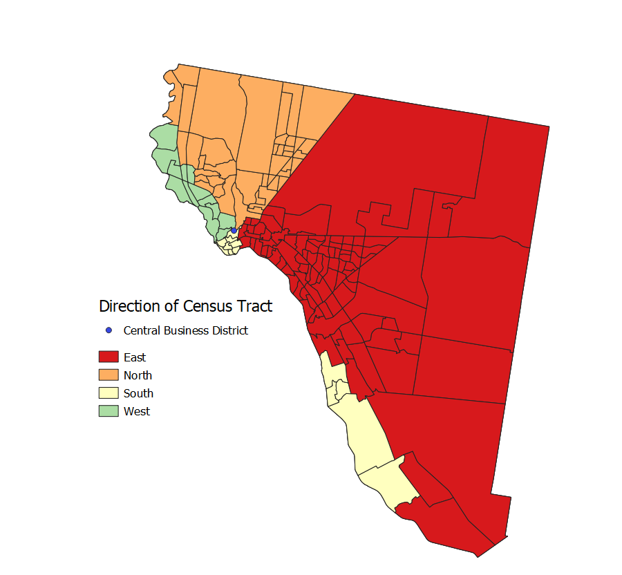

##  Lab 02: QGIS Direction and Distance Model

In the first lab, we created a model to calculate direction and distance from multiple polygons to a point. This type of model is helpful to find the direction and distance from selected census tracts to a Central Business District in a given city. I used the Execute SQL function in QGIS to preform the direction and distance functions. After finding the direction, I used field calculator to categorize the directions into North, East, South, and West. To text my model, I downloaded census tract data of EL Paso, Texas from the [U.S. Census Bureau American Fact Finder](https://factfinder.census.gov/faces/nav/jsf/pages/index.xhtml). I also downloaded census data for median gross rent and total latino population in El Paso, Texas to explore the relationship between these variables relative to distance and direction. The geopackages are linked below:
[Data](Data_Lab02.md)

The initial goal of this lab was to allow a user to input the central business district as either a shapefile or a point. I I initially created my model using the field calculator in QGIS. However, when I went to revise the model, I chose to use the Execute SQL function in QGIS instead of field calculator because I found this to be a simpler approach to finding the distance and direction. However, since I decided to use Exectue SQL, the user must input a point, not a shapefile, as the central business district - there is still work to be done! Below, I have uploaded maps of El Paso, Texas showing distance, cardinal direction, media gross rent, and latino population density per census tract in 2017. This lab would not be complete with a discussion of the larger purpose and process. Therefore, at the bottom of the page, I have included a narrative section in which I discuss GIS as a science versus GIS as a tool, and how it relates to this lab exercise. 

# QGIS Model
Here is a screen shot of my working model:

# Distance
Here is a map displaying the distance of El Paso census tracts from a point representing the Central Business District (for this lab, I used an arbitrary point):

# Cardinal Direction

Here is a map displaying the cardinal directions of El Paso census tracts from a point representing the Central Business District:

# Median Gross Rent
Here is a map displaying the median gross rent of census tracts in El Paso:

# Latino Population Density
Here is a map displaying the density of the latino population by census tract in El Paso:

# Graphs with Data Plotly

To further explore the relationship between median gross rent relative to distance and direction, I used the Data Plotly plug-in in QGIS. The first graph represents direction versus media gross rent on a [polar plot](mgr_dirc.html) and the second graph representing distance versus median gross rent on a [scatter plot](dist_mgr.html). 

Over the course of this lab exercise, our class had lively discussions about GIS as a tool versus GIS as a science. Personally, I was inclined to argue for GIS as a tool based off my experience working through this lab. The reason I say this is because the concept of exploring how median gross rent varies across space is very much rooted in geographical theory. GIS helped accomplish my goal, but the fundamental framework is laid by theory, such as Hoyt's sector theory. 

[Back to Main Page](index.md)
