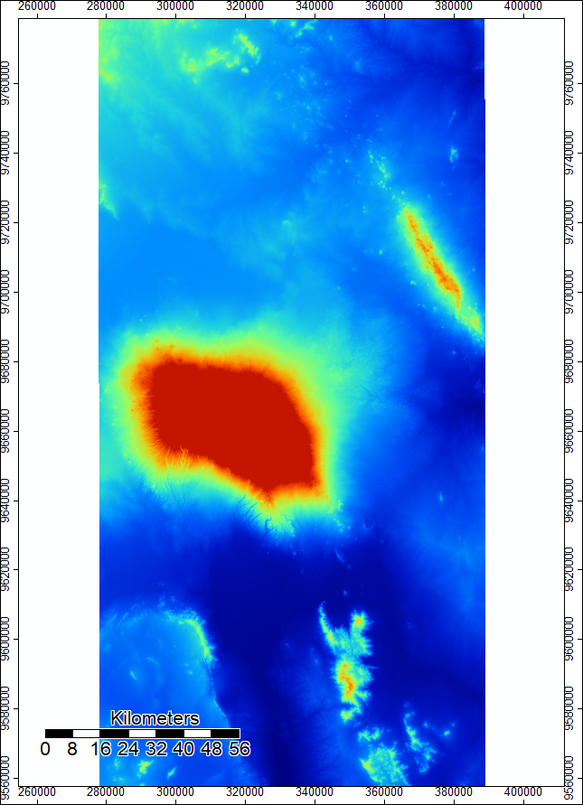
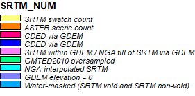

## Lab 04

In Lab 4, I used batch script files to preform the same hydrological analysis as Lab 3. To start, I downloaded the DEM files and the NUM files for both SRTM data and ASTER data [here](https://earthdata.nasa.gov/). The DEM file (Digital Elevation Model) contains elevation data in a raster layer. The NUM files contains the source of each data point in the DEM file, also displayed as a raster layer. For example, the orange in the SRTM NUM file represents DEM data sourced from ASTER data. 

Here are the SRTM DEM Files:

 

 

And here are the ASTER Files:

 

 
