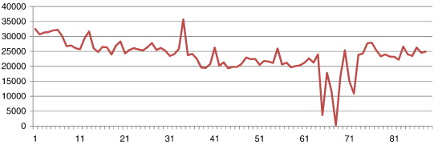
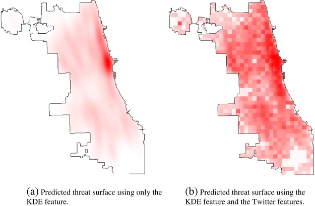

## Twitter Case Study!!

[Predicting crime using Twitter and Kernal density estimation](pdf.pdf)

Question: "Can we use the tweets posted by residents in a major U.S. city to predict local criminal activity?" 

The researchers in this study investigate whether or not incorporating Twitter data into their crime prediction model will improve the degree to which the researchers can predict local crime in U.S. cities. This study is using deductive reasoning since the researchers propose a hypothesis, test the hypothesis using observations and data , and eventually research a conclusion of whether or not Twitter data can help indicate local crime. 

Data: The researchers collected Twitter data using the official Twitter Streaming API. The researchers defined their time frame (January 1, 2013 to March 31, 2013) and the geographic limits for Chicago, Illinois (− 87.94011,41.64454] (lower-left corner) and [− 87.52413,42.02303] (upper-right corner). Below is an image of the number of tweets collected over the three month period. The researchers explain the spike in the data is due to the Super Bowl, and the drop in twitter data between day 61 and 71 are due to an error in their data collection process.

Reproducibility: The researchers are explicit about where they downloaded their crime data (from the Chicago Police Department using the Data Portal), and their Twitter data. Their methodology section includes an explaination about their use of LDA (latent Dirichlet Allocation) to predict the topic importance values for each neighborhood (the neighborhood boundaries are also defined and outlined by the researchers). The LDA method has additional help documentation and models online. The researchers then took out the stop-words using the method developed by Owoputi et al. (unclear if this package can be easily downloaded), and then the MALLET toolkit to predict the proportion of the discussion in each neighborhood that is devoted to each topic. The researchers then outline a step-by-step process of how they used the processed Twitter data in the crime prediction model. Below is an image of the crime prediction model only using the Kernal Density Estimation on the left and the crime prediction model including Twitter data on the right. 

Replicability: I think this type of crime analysis using Twitter data can be replicated in other a new case. I'm assumming the Data Portal on the Chicago Police Department page can be found in other U.S. cities. I'm not sure if this type of information is availability digitally in other countries. If not, then this type of analysis would have to involve digitizing the criminal activity in a city, which would take a considerable amount of time. 

Packages/Libraries:
ks Package = The ks package (kernal smoothing package) is located in the CRAN library 
Owoputi et. al stop-words package (can't find in R library)
MALLET toolkit (documentation online)
